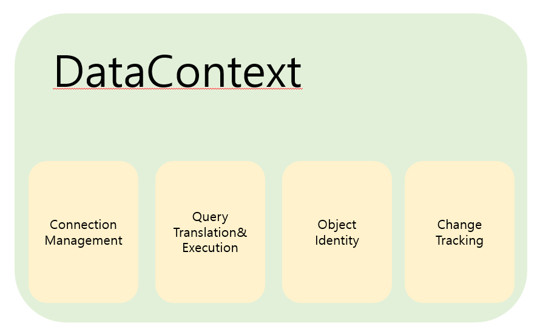
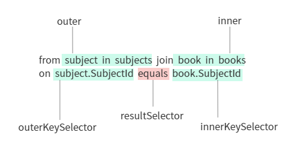

# Chapter06. LINQ to SQL을 시작하기🌸
- 가격이 30달러 이하인 책들의 목록을 추출하고 주제에 따라 분류하도록 하겠다
- 질의 완성을 위해 Books와 Subjects라는 두 개의 데이터 집합에서 정보를 얻어 조합하는 과정을 거쳐야 함
[LINQ to Objects를 이용하여 Subjects와 Books에 대해 질의하기]
```C#
IEnumerable<Book> books = Book.GetBooks();
IEnumerable<Subject> subjects = Subject.GetSubjects();

var query = from subject in subjects
            join book in books
                 on subject.SubjectId equals book.SubjectId
            where book.Price < 30
            orderby subject.Description, book.Title
            select new
            {
                subject.Description,
                book.Title,
                book.Price
            };
```
- SQL 데이터베이스에서 추출한 책과 주제를 담는 메모리 객체를 만든 뒤 그 객체에 대한 질의를 수행하는 형태로 문제를 해결하고 있음
- 예제 코드를 수행하면 다음과 같은 SQL 질의문들이 동적으로 생성될 것
```sql
SELECT  ID, Isbn, Notes, PageCount, Price, PubDate
        Publisher, Subject, Summary, Title
FROM    Book

SELECT  ID, Name, Description
FROM    Subject;
```
- 필터링과 사영, 정렬 모두 클라이언트에서 수행됨 => 데이터를 다루기 전에 무조건 모든 레코드의 모든 필드의 정보를 클라이언트의 메모리에 올려야 함
- 결과적으로 필요한 데이터 이상을 읽어들어야 함 ... -> 비효율!
- 데이터베이스 시스테밍 제공하는 "인덱싱" 이라는 무기를 잃어버리게 됨
- 네트워크 및 시스템상의 불필요한 부하를 초래하게 된다는 뜻!
- 데이터에 접근하는 코드를 모두 수작업으로 작성하는 것은 너무 위험천만하고 반복적인 일...

- LINQ to SQL은 네트워크 및 시스테 부하를 줄여주고 데이터베이스 인덱스를 사용할 수 있게 함
- 지루하고 반복적인 코드 작성을 줄여주는 존재!!
- LIN로 코드를 작성한다고 가정하면 다음처럼 간소화된 SQL 질의문들이 동적으로 생성되는 것을 볼 수 있음
```SQL
SELECT      t0.Description, t1.Title, t1.Price
FROM        Subject AS t0 INNER JOIN 
                    Book AS t1 ON t0.ID = t1.Subject
WHERE       (t1.Price < @p0)
ORDER BY    t0.Description, t1.Title
```
- 단 한줄의 코드를 더하고 두 줄을 살짝 조정 -> 놀라운 변화
- 놀라운 변화: 
    - 많은 양의 ADO.NET 기반의 코드를 줄일 수 있게 함
    - 주기적으로 메모리와 관계형 데이터베이스 간의 데이터 동기화를 위해 별도로 코드 작성할 필요 없음

## 6.1 LINQ to SQL 속으로 뛰어들기
- 가격이 30달러 이하인 책들을 주제별로 모으는 것을 목표로 함
- 그 과정은 주제를 질의하는 과정, 가격 조건을 ㅗ 걸러진 책의 목록을 질의 하는 과정 주제와 책을 조합하는 과정 등 몇 개의 분리된 과정으로 세분화 가능

[가격이 30달러 이하인 책들의 주제와 가격을 받아오기]

```C#
IEnumerable<Book> books = Book.GetBooks();
var query = from book in books
            where book.Price < 30
            orderby book.Title
            select new 
            {
                book.Title,
                book.Price
            };
```
- DB에서 모든 책의 목록을 받아오고 있음
- 클라이언트가 메모리상에 그 목록을 올린 뒤 필요한 책만을 추려내고 있음
- DB에 실제로 행해진 SQL 질의는 다음과 같음
```sql
SELECT  ID, Isbn, Notes, PageCount, Price, PubDate,
        Publisher, Subject, Summary, Title
FROM    book;
```
- Title과 Price라는 두 가지 정보만 필요로 함에도 불구하고 모든 정보를 다 읽어들이고 있음
- 필요로 하는 책들이 아니라 모든 책들의 정보를 읽어들이는 비효율적인 작업을 수행하고 있음
- 클라이언트의 메모리상에서 정렬 작업을 수행하므로 데이터베이스 시스템이 제공하는 인덱싱 기능의 혜택을 찾아볼 수 없음

- 데이터베이스에 다음과 같은 이상적인 질의문을 보내주려고 함
```sql
SELECT      Title, Price
FROM        Book AS t0
WHERE       (Price < @p0)
ORDER BY    Title
```
- 이러한 이상적틴 코드를 DB 시스템에 보내주기 위해 얼마나 많은 수정을 해야 할까?
- 답: 하나도 없다
- 해야 할 일: Book 클래스를 수정하고 그것을 접근하는 방법을 바꿔주어야 함

- 먼저 DB 테이블과 메머리 객체의 정보항목들에 대해 일대일 매핑을 적용할 것임
- 이 장의 후반부에서 이 테이블을 주제 테이블과 연결지어 데이터베이스의 외래 키 기능과 연동시키는 방법에 대해 살펴볼 것
```C#
public class Book
{
    public Guid BookId { get; set; }
    public string Isbn { get; set; }
    public string Notes { get; set; }
    public Int32 PageCount { get; set; }
    public Decimal Price { get; set; }
    public DateTime PublicationDate { get; set; }
    public string Summary { get; set; }
    public string Title { get; set; }
    public Guid SubjectId { get; set; }
    public Guid PublisherId { get; set; }
}
```
### 6.1.1 객체 매핑을 설정하기
- Book 클래스를 활성화하는 것부터 LINQ to SQL에 대해 배워보기
- 우선 .NET Framework 3.5의 일부분인 System.Data.Linq 어셈블리를 참조해야 함
- System.Data.Linq 어셈블리를 참조해야 함
- using 구문을 활용하여 클래스의 맨 위에서 정의해줘야 함
- Mapping 네임스페이스는 DB와 객체 간의 매핑을 선언적으로 확립할 수 있게 해줌
`using System.Data.Linq.Mappng`

- 속성(attribute)를 통해 데이터 매핑을 선언할 것
- 대부분의 경우 클래스 내애서 어떤 테이블과 관련된 매핑인지, 어떤 열과 관련된 매핑인지에 대해 정의해야 함
- Book 테이블을 메모리 내의 객체와 연관짓는 것이 가장 쉬운 매핑
- 이런 경우에는 데이터베이스는 Book이라는 테이블이 있고 메모리 객체에도 또한 Book이라는 이름의 클래스가 있어야 함
- 이미 이름이 같고 일대일 매핑이 가능한 데이터베이스 테이블과 메모리 객체를 갖추고 있지만 명시적으로 이 두 가지를 매핑하기 위해 클래스 정의에 Table이라는 속성을 추가해야 함
```C#
[Table]
public class Book {...}
```
- 좀 더 명시적으로 선언하고 싶다면 테이블의 이름에 Name이라는 매개변수를 이용함
```C#
[Table(Name="dbo.Book")]
public class Book {...}
```
- 클래스 속의 프로퍼티와 테이블 속의 열이 어떠한 일대일 대응관계를 갖는지 정의해야 함
- 매핑하고자 하는 프로퍼티들에 Column이라는 속성을 추가하는 방법을 이용
```C#
[Column]
public String Title {get; set;}
```
- 항상 직접적인 매핑만을 선택해야 하는 것은 아님
- 테이블의 열 이름과 메모리 내 객체의 프로퍼티 이름이 일치하지 않게 할 수도 있음
- 예를 들면... Book 테이블에는 PubDate라는 열이 있지만 실제 애플리케이션을 제작하는 사람들이 더 직관적으로 데이터를 이용할 수 있도록 장황한 이름을 이용하여 PublicationDate라는 이름의 프로퍼티와 매핑시킬 수 있음
- 이를 위해서 클래스 정의에 추가된 속성에 해당 열의 이름을 추가해야 함
```C#
[Column(Name="PubDate")]
public DateTime PublicatoinDate{ get; set; }
```
- 양쪽 모두에 확실히 정의해주어야 하는 것: 기본키(primary key)
- 이 예제에서는 BookId임
- 여기서 Name이라는 매개변수 외에 IsPrimaryKey라는 매개변수를 추가적으로 선언해야 함
- LINQ to SQL은 객체 간의 고유한 구별을 위해 각각의 객체에서 최소한 하나의 프로퍼티가 기본키로 지정될 것을 강제함
```C#
[Column(Name="ID", IsPrimaryKey=true)]
public Guid BookId { get; set; }
```
- 같은 방법으로 클래스 속에 있는 모든 프로퍼티들에 대해 매핑을 선언하면...
```C#
[Table]
using System.Data.Linq.Mapping;

public class Book
{
    [Column(Name = "ID", IsPrimaryKey = true)]
    public Guid BookId { get; set; }
    [Column]
    public string Isbn { get; set; }
    [Column(CanBeNull=true)]
    public string Notes { get; set; }
    [Column]
    public Int32 PageCount { get; set; }
    [Column]
    public Decimal Price { get; set; }
    [Column(CanBeNull = true)]
    public string Summary { get; set; }
    [Column(Name = "PubDate")]
    public DateTime PublicatoinDate { get; set; }

    [Column]
    public string Title { get; set; }
    [Column(Name = "Subject")]
    public Guid SubjectId { get; set; }
    [Column(Name = "Publisher")]
    public Guid PublisherId { get; set; }
}
```
- 언뜻 보면 코드 양이 두 배 늘어난 것처럼 보이지만 이 덕분에 CRUD와 관련도니 코드를 별도로 하지 않아도 됨
- -> 결국 앞으로 엄청난 양의 코드를 절약할 수 있음
- -> 그리고 특화된 질의의 수행을 위해 특호된 형태의 루틴 구현을 별도로 할 필요 없음! 나머지 작업은 프레임워크가 해준다!
- 고로 단순한 매핑을 한 번 정의해주기만 하면 됨

- 연결한 테이블이 어떤 데이터베이스에 속해 있는지 지정해주지 않았음
- 새로운 System.Data.Linq 네임스페이스에 속한 DataContext라는 새로운 객체를 생성하는 방법으로 DB와의 연결을 정의함!

### 6.1.2 DataContext를 설정하기
- DataContext는 LINQ to SQL의 핵심으로 대부분의 내부 작업을 담당함
  [DataContext에 의해 제공되는 서비스]
  

- 우선 DB와의 연결을 관장
- DataContext에  연결에 필요한 정보를 담은 연결 문자열(connection string)을 명시해줌
- DataContext가 그 정보를 근거로 DB에 대한 연결을 열고 닫는 역할을 전부 맡아 처리해줌
- 결과적으로 불필요하게 매우 성가시고 성능상의 문제를 야기시킬 수 있는 연결 관련 정보를 매번 처리하지 않아도 됨

- DataContext를 이용하여 작업을 시작하기에 앞서, 데이터베이스에 관한 연결 문자열을 바탕으로 새로운 DataContext 객체의 인스턴스를 생성해야 함
`DataContext dataContext = new DataContext(liaConnectionString);`

- DataContext는 매핑 관련 일도 담당, 데이터베이스에서 추출한 정보를 메머리 객체로 옮겨 담는 중요한 역할도 담당함
- DataContext는 데이터를 이런 일을 위해 특화된 Table<> 형태의 기본 컬렉션 객체로 넘겨줌
- DataContext 객체에서 책들의 정보가 담긴 테이블을 가져오기 위해 dataContext.GetTable<Book>; 을 호출하면 됨
```C#
DataContext dataContext = new DataContext(liaConnectionString);
Table<Book> books = dataContext.GetTable<Book>();
```
- LINQ to SQL 없이 객체들의 집합을 반환하기 위해 보통 List<Book> 같은 형태의 List<>형을 이용함
- 그러나 LINQ to SQL을 이용할 경우, Table<Book>이라는 새로운 형태로 반환하게 됨
- 이런 변화를 통해 단순히 원시적 데이터 형태가 아닌 좀 더 다루고 접근하기 용이한 데이터 형태를 이용할 수 있다는 장점을 얻을 수 있음
- 이 변화는 DB에 실제로 데이터에 대한 요청을 하기 전에 질의문을 수정할 수 있도록 해줌

## 6.2 LINQ to SQL을 이용하여 데이터 받아오기
- DB에서 값들을 선택하는 과정!을 처음 알아볼 것
- GetTable을 통해 데이터에 접근하는 방법을 한 가지 알아봄
- 일반적인 Table 클래스는 IEnumerable<T>의 새로운 확장형인 IQueryable<T> 인터페이스를 구현하고 있음
- IEnumerable<T>를 확장하여 구현하고 있으므로 LINQ to Objects에서 이용했던 표준 질의 연산자들을 그대로 사용 가능함
- DB에서 추출한 새로운 형태의 Book 객체에서 모든 책들의 데이터를 받아오는 간단한 질의를 살펴볼 것!<br>
[LINQ to SQL을 이용하여 책 데이터를 받아오기]
```C#
DataContext dataContext = new DataContext(liaConnectionString);
IQueryable<Book> query = from book in dataContext.GetTable<Book>()
                         select book;
```
- 데이터베이스에 실제로 보낸 질의문을 살펴보는 방법에는 여러 가지가 있음
- SQL Server와 함께 배포되는 SQL Server Profiler를 통해 DB에 어떤 질의 명령들이 주어지는지를 쉽게 볼 수 있음
- 이런 방법이 아니어도 DataContext의 Log 프로퍼티를 출력 스트림에 연결하는 방법도 있음
[Console이라는 출력 스트림에 연결된 경우]
`dataContext.Log = Console.Out;`
    - 이런 형태로 로깅 기능이 설정되면 DB에 전달되는 모든 SQL 명령문들은 출력 스트림으로 전달되어 사용자가 확인할 수 있게 됨
- 또 다른 대안으로는 코드 내에서 DataContext 객체의 GetCommand 메소드를 통해 질의문에 접근하는 방법이 있음
`Console.WriteLine(dataContext.GetCommand(query).CommandText);`
    - 이 명령은 곧 전달될 질의를 보여줄 것

- LINQ to SQL은 표준적인 LINQ 질의 표현을 기반으로 하고 있음 -> 필요로 하는 컬럼들로 데이터 전달의 대상을 제한시킬 수 있음
- 책 주제에 관한 정보만 필요로 한다면 다음처럼 select 구문을 수정하는 방법이 있음<br>
[책 주제의 목록을 받아오기]
```C#
DataContext dataContext = new DataContext(liaConnectionString);
dataContext.Log = Console.Out;
IEnumerable<String> query = 
    from book in dataContext.GetTable<Book>
    select book.Title;
```
- dataContext.Log를 이용했으므로 출력창에서 다음처럼 자동 생성된 SQL 질의문 확인 가능
```sql
SELECT [t0].[Title]
FROM [Book] AS [t0]
```
- 그런데 책의 주제와 가격만 알고 싶음..!
- 임시 구조체를 변경해야 함!
[익명형으로 데이터를 사영하기]
```C#
var query = from book in dataContext.GetTable<Book>()
            select new
            {
                book.Title,
                book.Price
            };
```
[자동 생성된 질의문]
```sql
SELECT [t0].[Title], [t0].[Price]
FROM [Book] AS [t0]
```

- 실제로 SQL 질의문은 데이터에 처음 접근하는 순간에 수행됨
- query 변수는 원하는 데이터 접근방법에 대한 정보를 갖고 있고 데이터 자체는 포함하고 있지 않음
- 질의문의 수행은 처음 그 데이터가 사용될 떄까지 연기됨

- 질의의 결과물이 필요한 시점 이전에 앞서 질의를 수행하지 않음 
- -> 수행되기 전에 질의에 추가적 조건이나 기능을 더해나갈 수 있음
- 다음 예제에서 Skip과 Take라는 구문을 이용하여 페이지 기능 구현 가능 
- LINQ to SQL이 그 부가적인 질의 옵션들과 초기 질의문을 잘 조합하여 최적화된 SQL 질의문을 생성해줌<br>

[조합을 이용하여 데이터를 페이지화하기]
```C#
DataContext dataContext = new DataContext(liaConnectionString);
dataContext.Log = Console.Out;

var books= dataContext.GetTable<Book>();

var query = from book in books
            select new
            {
                book.Title,
                book.Price
            };
var pagedTitles = query.Skip(2);
var titlesToShow = PagedTitles.Take(2);

ObjectDumper.Write(titlesToShow);
```
[자동 생성된 SQL]
```sql
SELECT      [t1].[Title], [t1].[Price]
FROM        (SELECT     ROW_NUMBER()
                        OVER (ORDER BY [t0].[Title], [t0].[Price])
                        AS [ROW_NUMBER], [t0].[Title], [t0].[Price]
             FROM       [dbo].[Book] AS [t0]) AS [t1])
WHERE       [t1].[ROW_NUMBER] BETWEEN @p0 +1
            AND @p0 + @p1
ORDER BY    [t1].[ROW_NUMBER]
```
## 6.3 질의 다듬기
- 관계형 DB는 연관성을 가진 데이터들을 손쉽게 관리하고 접근할 수 있는 특수한 기능들을 제공함
- 인덱스 기능과 질의문의 수행순서를 동적으로 조절 -> DB는 인덱스 기능을 활용하지 않는 경우에 비해 월등한 성능을 제공함
- 서버에서 정질의문을 수행하는 방법 -> 네트워크를 통해 전송되어야 하는 데이터의 양을 상당히 줄일 수 있음
- **네트워크 사용량을 감소시키는 것**: 데이터 중심의 애플리케이션의 가장 빈번하고 심각한 병목지점(매우 중요)

### 6.3.1 필터링
- LINQ to SQL은 완벽한 수준의 필터링 기능을 제공함
[30달러보다 저렴한 책을 선발하는 예제]
```C#
var books = dataContext.GetTable<Book>();
var query = from book in books
            where book.Price < 30
            select book;
```
[이 코드에 의해 자동으로 생성된 SQL문]
```sql
SELECT  [t0].[Title]
FROM    [dbo].[Book] AS [t0]
WHERE   [t0].[Price] < @p0
```
- LINQ to SQL을 사용하면 필터링 조건을 서버에서 수행되는 질의문의 매개변수로 전달 가능
- 필요로 하는 레코드들만 전송될 수 있도록 최적화가 가능함.
- 매개변수화된 질의를 사용할 시의 장점:     
    - 부가적으로 매개변수화된 질의를 사용하면 몇 가지 고질적인 문제 해결 가능
        - 인젝션 기능을 통해 데이터베이스 테이블을 날려버린다거나 하는 유형의 위험에서 자유로워짐
        - 이런 유형의 *인젝션 공격* 의 위험성을 제거하는 방법ㅂ: 프로시저 또는 매개변수화된 질의를 이용하는 방법
    - SQL Server의 질의 계획 캐시기능을 활용 가능함
        - SQL Server는 매개변수들만 바뀌는 질의들이 가장 효율적으로 재활용되어 수행되도록 계획하고 보관함
        - 자주 수행되는 형태의 질의라면 저장된 계획에 따라 수행하는 것이 훨씬 좋은 성능을 발휘할 수 있음

- 몇몇 SQL 필터링 옵션은 .NET 프레임워크에서 사용되는 형과 완전히 호환되지 않는 경우가 있음
- 이 경우 LINQ는 SQL구문과 가장 유사한 형태의 데이터 처리함수가 호출될 수 있도록 조정함.

- 예시: SQL에서의 LIKE 구문
    - LIKE는 패턴 매칭기법을 이용하여 레코드를 검색함
    - .NET 프레임워크에서는 이 대신 String 객체에 대해 StartsWith, EndsWith, Contains라는 유사한 용도의 함수들을 가지고 있음
    - LINQ to SQL은 이런 .NET 프레임워크의 함수 호출을 SqlMethods.Like 메소드라는 중개자를 통해 LIKE를 이용하여 .NET 프레임워크 상에서 유사한 기능을 구현 가능하도록 해줌
    - 따라서 "on"이라는 문자열을 포함하는 모든 책들을 검색하기 위해 다음 코드와 같은 LINQ 식을 이용함
    ```C#
        var books = dataContext.GetTable<Book>();
        var query = from book in books
                    where book.Title.Contains("on")
                    select book.Title;
    ```
    - Contains를 이용한 질의식은 다음의 SQL 표현식으로 자동 변환됨
    ```C#
        SELECT  [t0].[Title]
        FROM    [dbo].[Book] AS [t0]
        WHERE   [t0].[Title] LIKE @p0
        -- @p0: Input NVarChar(Size = 4) NOT NULL [%on%]
    ```
    - Contains라는 .NET 프레임워크의 메소드가 LIKE와 %라는 와일드카드 문자를 이용한 SQL식으로 변환됨
    - 그러나 모든 CLR 함수들이 DB식으로 변환될 수 있는 것은 아님. 
    ```C#
        var query = 
            from book in books
            where books.PublicationDate >= DateTime.Parse("1/1/2007")
            select books.PublicationDate.Value.ToString("MM/dd/yyyy");
    ```
    - 이 예제에서 변환 프로바이더는 DateTime.Parse 메소드를 변환시켜 DB에 따라 날짜 정보를 알맞게 삽입 가능함.
    - select절 내에서 데이터의 형식을 변환하기 위해 ToSTring 메소드를 사용하는 것은 불가능함.
- 변환지원은 프로바이더에 매우 의존적
- 어떤 메소드가 지원되는지 확신이 없다면 사용해보고 동작하는 지 확인하는 게 빠르다
- 필터가 클라이언트 대신 서버에 적용될 수 있게 하는 것 -> 엄청난 양의 네트워크 대역폭을 절약, 데이터베이스의 인덱스 효과 얻을 수 있게 됨

### 6.3.2 정렬과 그룹화
DB의 강력한 기능을 제대로 활용하기 위해 BD가 정의한 인덱스를 사용간으해야 함
- 질의표현식의 orderby와 orderby...descending 은 정렬 표현식을 데이터베이스가 알아들을 수 있게 변환해주는 역할을 함
```C#
var books = dateContext.GetTable<Book>();
var query = from book in books
            where book.Price < 30
            orderby book.Title
            select book.Title;
```
[결과로 반환된 질의 문자열]
```SQL
SELECT      [t0].[Title]
FROM        [Book] AS [t0]
WHERE       [t0].[Price] < @p0
ORDER BY    [t0].[Price]
```
- 목표의 일부분인 클라이언트 대신 DB의 인덱스를 활용하여 정렬하는 기능 완성
- 결과를 내림차순으로 정럴하려고 했다면 마지막 절에 descending이라고 명시를 해주었을 것

[그룹화와 정렬]
```C#
var query = 
    from book in dataContext.GetTable<Book>()
    group book by book.SubejctId into groupedBooks
    orderby groupedBooks.Key
    select new 
    {
        SubjectId = groupedBooks.Key,
        Books = groupedBooks
    };

foreach(var groupedBook in query)
{
    Console.WriteLine("Subject: {0}", groupedBook.SubjectId);
    foreach(Book item in groupedBook.Books)
    {
        Console.WriteLie("Book: {0}". item.Title);
    }
}
```
- 반환되는 객체 = 정렬된 컬렉션 형태
```sql
SELECT  [t1].[SubjectId] AS [Key]
FROM (
    SELECT  [t0].[Subject] AS [SubjectId]
    FROM    [dbo].[Book] AS [t0]
    GROUP BY [t0].[Subject]
    ) AS [t1]
ORDER BY [t1].[SubjectId];
```
- 이 질의는 키값만 반환함
- 결과 속을 순환할 떄마다 각각의 그룹에 대해 개별 질의가 수행됨
- 결과가 되는 컬렉션은 groupedBooks 객체에 포함되어 있음
- 결과를 그룹화했을 떄, 그 그룹에 대해 몇 가지 누적연산을 수행 가능하면 개수 평균값, 총합계 등을 간편하게 확인 가능함.

### 6.3.3 누적 연산
- LINQ to SQL은 IEnumerable<T>를 확장하는 모든 표준 누적연산 메소드들을 지원함
- 각각의 분류에 해당하는 책의 개수를 보여주는 질의도 쉽게 작성 가능함<br>
[결과에 누적연산을 포함시키기]
```C#
Table<Book> books = dataContext.GetTable<Book>();
var query = from book in books
            group book by book.SubjectId into groupedBooks
            select new
            {
                groupedBooks.Key,
                BookCount = groupedBooks.Count()
            };
```

- select 절에 익명형 이용 -> 그룹화된 책 컬렉션을 가져와서 주제별로 책의 개수를 반환함
- 결과 집합 속을 순환하면서 모든 책들을 반환한 뒤 클라이언트에서 개수를 세는 방법을 이용한다고 생각하면 매우 비효율적일 수 있음
- LINQ to SQL은 좀 더 진보된 방식으로 서버에서 개수 센 다음, 필요한 정보만을 반환하여 네트워크상의 불필요한 부하를 줄여줌<br>
[생성된 SQL문]
```sql
SELECT      COUNT(*) AS [BookCount], [t0].[Subject] AS [SubjectId]
FROM        [Book] AS [t0]
GROUP BY    [t0].[Subject]
```

[여러 개의 누적연산을 함께 사용하기]
```C#
Table<Book> books = dataContext.GetTable<Book>();
var query =
    from book in books
    group book by book.SubjectId into groupedBooks
    select new
    {
        groupedBooks.Key,
        TotalPrice = groupedBooks.Sum(b => b.Price),
        LowPrice = groupedBooks.Min(b => b.Price),
        HighPrice = groupedBooks.Max(b => b.Price),
        AveragePrice = groupedBooks.Average(b => b.Price)
    };
```
- 누적 메소드들은 적절한 SQL로 변환되고 누적연산은 데이터베이스 내에서 수행됨
- 그 다음, DB는 필요로 하는 데이터만 반환해줌 -> 반환해야 할 데이터의 양을 최소화함
- 기본적으로 LINQ to SQL은 결과를 조인하는 몇 가지 방법을 제공해줌

### 6.3.4 조인하기
- 여러 테이블의 데이터를 조합해 사용하는 것은 관계형 DB의 정신이자 핵심임
- LINQ to SQL은 연관이 있는 데이터 집합끼리 조인할 수 있는 몇 가지 방법을 제공해줌
- 이런 방법으로 단순히 외래키 외에 주제의 이름도 출력 가능함

- LINQ to SQL은 조인을 위한 두 가지 문법을 지원함
- 1. Where절에서의 비교 연산자를 이용한 문법
    - ANSI-82 SQL 표준문법에서 권장하는 방법과 동일함
    - 이 문법을 이용하기 위해 Book과 Subject 테이블 객체에 대한 참조를 가져올 수 있음
    - 테이블 객체를 참고하면 어떻게 동일한 SubjectId를 공유하는 Subject 객체와 Book 객체에서 데이터를 조인하여 가져오는 질의 표현식을 작성할 수 있는지 알 수 있음<br>
      [Books와 Subjects를 조인하기]
    ```C#
    var subjects = dataContext.GetTable<Subject>();
    var books = dataContext.GetTable<Book>();
    var query = from subject in subjects
                from book in books
                where subject.SubjectId = book.SubjectId
                select new { subject.Name, book.Title, book.Price}
    ```
- 2. Join 문법 지원
    ```C#
    var query = from subject in subjects join book in books
            on subject.SubjectId equals Book.subjectId
            select new { subject.Name, book.Title, book.Price};
    ```
- **LINQ의 join절에서는 원본과 대상 객체의 순서가 매우 중요함**
- DB에서 사용되는 SQL과는 달리 LINQ 문법은 매우 엄격하며 관대함을 기대하기 어려움
    - 질의 표현식들은 메소드로 변환됨 -> 테이블의 순서를 변경하면서 항목의 순서를 변경하지 않는 경우 컴파일 에러를 발생시킬 수 있음<br>
[System.Linq.Enumerable.Join 확장 메소드의 정의]
```C#
public static IEnumerable<TResult> Join<TOuter, TInner TKey, TResult>
    (this IEnumerable<TOuter> outer, IEnumerable<TInner> inner,
    Func<TOuter, TKey> outerKeySelector,
    Func<TOuter, TKey> innerKeySelector,
    Func<TOuter, TInner, TResult> resultSelector)
```
- 주목할 점: 
    - **첫 번째와 세 번째 매개변수가 관련 있음**
    - **두 번째와 네 번째 매개변수가 관련 있음**

- 질의 내의 Join 연산자가 확장 메소드의 매개변수들에 어떻게 매핑되는지를 보여줌
- 만약 outer와 inner 매개변수, 또는 innerKeySelect와 outerKeySelector의 순서를 잘못 지정해주면 실제 확장 메소드로의 변환이 이루어질 때 예상치 못한 결과를 맞을 수 있음

- 지금까지는 양쪽 테이블에서 일치하는 값을 가진 겨웅에만 반환하는 카테시안조인(=내부 조인)이 주로 설명됨
- 그러나 종종 한쪽 테이블에 있는 정보를 다른 테이블에 일치하는 정보가 없는 경우에도 출력하고플 때가 있음
- 이런 상황을 SQL 용어에서는 **외부 조인(outer join)**이라고 함
```sql
SELECT      Subject.Name, Book.Title
FROM        Subject LEFT OUTER JOIN
                Book ON Subject.ID = Book.Subject
```
- 이런 기능을 하는 LINQ 질의를 작성하려면 주제가 존재하거나 null인 책들을 찾고 있다는 것을 알아야 함!
- DefaultIfEmpty() 확장 메소드는 이런 상황에서 큰 도움이 될 수 있음
```C#
var query =
    from subject in Subjects
    join book in books
        on subject.SubjectId equals book.SubjectId into joinedBooks
    from joinedBook in joinedBooks.DefaultIfEmpty()
    select new
    {
        subject.Name,
        joinedBook.Title,
        joinedBook.Price
    };
```     
- 이런 경우, joinedBooks라는 새로운 임시 객체에 책과 주제를 조인한 결과를 저장해야 함
- 그리고 Subjects와 조인된 Books에서 결과를 나타내기 위해 DefaultIfEmpty 확장 메소드를 이용하여 책을 갖지 않는 주제도 나타내야 함
- 책과 주제의 정보를 조합 가능해짐
[원래의 예제를 LINQ to SQL을 이용하여 다시 작성하기]
```C#
DataContext dataContext = new DataContext(liaConnectionString);

Table<Subject> subjects = dataContext.GetTable<Subject>();
Table<Book> books = dataContext.GetTable<Book>();

var query = from subject in subjects
            join book in books
                on subject.SubjectId equals book.SubjectId
            where book.Price < 30
            orderby subject.Name
            select new
            {
                subject.Name,
                joinedBook.Title,
                joinedBook.Price
            };
```

[생성된 질의]
```sql
SELECT      t0.Name, t1.Title, t1.Price
FROM        Subject AS t0 INNER JOIN
                       Book AS t1 ON t0.ID = t1.Subject
WHERE       (t1.Price < @p0)
ORDER BY    t0.Name
```
- 모든 열을 전송하는 것이 아니라, 사용자가 필요로 하는 열만 선별하여 전송하고 있음
- 서버상에서 조인, 필터링, 정렬 등의 작업이 동작함

- 애플리케이션을 개발할 때, 객체의 계층구조를 그대로 유지하면서 작업하는 것이 더 유리한 경우도 있음
## 6.4 객체 트리를 다루기

## 6.5 내 데이터는 어느 시점에 로딩되는가? 그리고 그것이 왜 중요할까?

## 6.6 데이터를 업데이트하기

## 6.7 요약