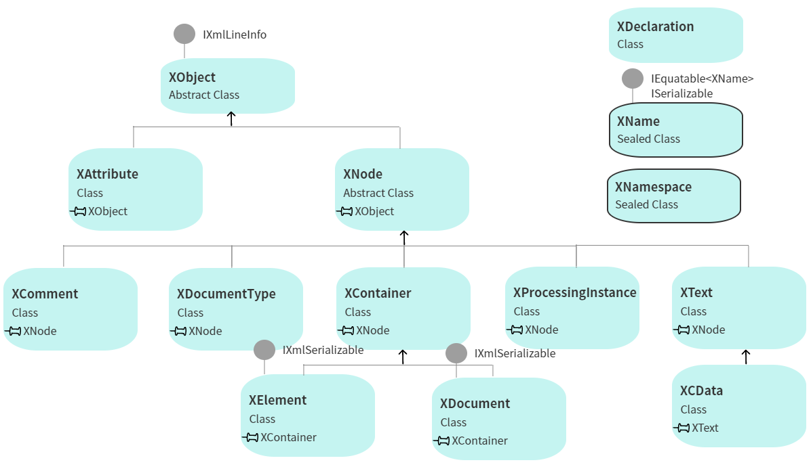

# Chapter09. LINQ to XML의 소개🐳
- LINQ to XML은 LINQ가 제공하는 강력한 질의기능을 XML 데이터에 대해서도 사용 가능하게 함
- 개발자들에게 새로운 XML 프로그래밍 API를 제공해줌
- LINQ to XML API를 잘 다루려면 LINQ to XML이 설계당시에 어떤 목적과 사상에 바탕을 두고 있었는지 자세히 알아볼 필요가 있음
- 이 장에서는 설계상의 원칙이나 LINQ to XML의 핵심을 구성하는 개념들을 소개함
- MS사가 왜 LINQ to XML이라는 개념을 설계하고 제품화하게 되었는지를 완벽하게 이해하고 공감할 수 있게 된 다음에 LINQ to XML의 클래스 구조를 살펴볼 것
- 클래스 구조를 살펴보면서, LINQ to XML API에서 사용하는 몇몇 주요 생성자 및 메소드들에 대해 알아봄
- LINQ to XML이 제공하는 클래스들의 구조에 대해 이해하고 난 후에는 XML을 이용하는 애플리케이션을 작성하면서 LINQ를 사용하여 읽기, 해석하기, 수정하기, 삭제하기, 저장하기 등의 조작을 XML에 가하는 방법에 대해 알아봄

## 9.1. XML API란 무엇인가?
- XML API는 개발자들에게 XML 데이터를 다룰 수 이는 프로그래밍 인터페이스를 제공함
- XML API를 사용함 -> XML을 사용하는 애플리케이션 작성 가능
- 다음의 예시를 통해 그러한 API를 왜 필요로 하는 지 살펴보자
- [웹 사이트 주소를 담고 있는 예시 XML 파일]
```XML
<links>
    <link>
        <url>http://linqaction.net</url>
        <name>LINQ in Action</name>
    </link>
    <link>
        <url>http://hookedonlinq.com</url>
        <name>Hooked on LINQ</name>
    </link>
    <link>
        <url>http://msdn.micorosoft.com/data/linq/</url>
        <name>The LINQ Project</name>
    </link>
</links>
```
- XML을 다루기 위해서라면 API를 이용하는 것이 나음
- 만약 XML을 매우 원시적인 수준에서 다루고 싶다면 XmlTextReader 클래스를 이용하는 것이 좋음
- 만일 매우 큰 문서를 다룬다면 XmlReader와 같은 스트리밍 API를 이용하는 것이 좋음
- 만약 XML을 자유롭게 훑어보고 트리구조를 탐색하고 싶다면 XmlNode 클래스를 사용하거나 XPath 표현식을 이용하여 XML 트리구조를 탐색할 수 있게 해주는 XPathNavigator를 통해 DOM을 이용하는 것이 좋음
- 각각의 API는 고유의 장단점을 가지고 있음
- 그러나.. 이런 API들이 가진 공통점: 개발자들이 그들의 애플리케이션에서 XML을 활용하기 쉽게 해준다는 점
- 왜 또다른 새로운 XML 프로그래밍 API를 필요로 했는지 알아보기

## 9.2. 왜 XML을 처리하는 새로운 방법이 필요한가?
- 현재 존재하는 API들을 활용시 개발자들은 상당히 많은 것들을 염두에 두어야 함
    - 어떤 것을 사용할 지 선택, 각각의 API들의 미묘한 차이점 이해, 완전히 다른 관점에서 설계되고 구현된 모델들에 대해 배워야 함
- 대다수의 개발자들에게 XML이라는 기술이 가진 넓은 범위와 깊이, XML을 사용하면서 해야하는 수많은 기술적 선택들은 엄청난 부담이 됨

- LINQ to XML은 평이한 많은 개발자들이 간단하고 강력하게 사용 가능한 새롱누 XML 프로그래밍 API를 제공함으로 이런 문제를 해결하려고 했음
- LINQ는 XQuery와 XPath가 가진 질의 및 변형의 강력함을 .NET 프로그램이 언어 속에 잘 녹아들게 했음
- 메모리 내의 데이터 접근 API 또한 제공하는 형태로 XML 데이터를 매우 일관적이고 예측 가능한 형태로 다룰 수 있게 했음
- nullable형이나 함수형 생성기능은 매우 보편적으로 이용됨
- LINQ는 확장 메소드 및 익명형, 람다 표현식 등으로 스스로 언어적 진보를 이루고 있음

- LINQ to XML의 핵심 설계원칙들을 살펴보면서 기존의 .NET XML API들과 LINQ 가 어떤 차이를 갖고 있는지 이해해보기

## 9.3. LINQ to XML의 설계철학
- 일반적인 XML 프로그래머들이 XML에 의한 작업을 더 생성적이고 덜 지루하게 할 수 있도록 MS사는 LINQ to XML의 설계에 완전 새로운 접근방법을 택함
- LINQ는 개념적으로나 실제 성능 및 메모리 사용 측면에서 매우 경량의 플랫폼으로 기획되었음
- LINQ to XML 데이터 모델은 W3C Information Set을 매우 신중하게 참고하여 설계됨

- 논의할 설계철학이 XML을 다룰 떄 어떤 차이를 가져올지 확실하게 평가하기 위해서 현존하는 가장 유명한 XML 프로그래밍 ZPI인 DOM을 이용하여 간단한 XML 문서를 만든 후에 동일한 작업을 LINQ to XML을 이용하여 해보겠음
- 이 예제의 목표: LINQBooks에 포함되어 있는 책에 관한 상세 정보드릉ㄹ 추출해서 XML 문서로 만드는 것
- [누군가의 서가에 있는 책 중 가장 중요한 책]
```xml
<books>
    <title>LINQ in Action</title>
    <author>Fabrice Marguerie</author>
    <author>Steve Eichert</author>
    <author>Jim Wooley</author>
    <publisher>Manning</publisher>
</books>
```
- 이 문서를 위해 작성해야 하는 코드는 다음과 같음
- [DOM을 이용하여 XML 문서 만들기]
```C#
XmlDocumnet doc = new XmlDocument();
XmlElement books = doc.CreateElement("books");
XmlElement author1 = doc.CreateElement("author");
author1.InnerText = "Fabrice Marguerie";
XmlElement author2 = doc.CreateElement("author");
author2.InnerText = "Steve Eichert";
XmlElement author3 = doc.CreateElement("author");
author3.InnerText = "Jim Wooley";
XmlElement title = doc.CreateElement("title");
title.Innertext = "LINQ in Action";
XmlElement book = doc.CreateElement("book");
book.AppendChild(author1);
book.AppendChild(author2);
book.AppendChild(author3);
book.AppendChild(title);
books.AppendChild(book);
doc.AppendChild(books);
```
- DOM을 이용해서 XML 문서를 만들려면 강제로 명령형 생성 모델을 이용하도로고 되어 있음
- 명령형 생성 모델의 결과물은 만들어지는 XML과 전혀 다른 모습을 하고 있음
- XML과 같은 계층구조를 갖지 않고 모든 코드는 하나의 계층을 갖는 매우 밋밋한 형태로 되어 있음 
- 추가적으로, 매우 많은 임시 변수들을 만들어서 우리가 작성하는 개체들을 가지고 있어야 함
- 이런 특성상 코드의 가독성은 매우 떨어지며 디버깅이나 유지 보수가 어려움
- 작성한 코드의 구조가 궁극적으로 만들고 싶은 XML 문서의 구조와 매우 많이 다름
- LINQ to XML을 이용하여 작성하는 경우와의 차이점 알아보기
- [LINQ to XML을 이용하여 XML 문서를 생성하기]
```C#
new XElement("books",
  new XElement("book",
    new XElement("author", "Fabrice Marguerie"),
    new XElement("author", "Steve Eichert"),
    new XElement("author", "Jim Wooley"),
    new XElement("title", "LINQ in Action"),
    new XElement("publisher", "Manning")
  )
);
```
- 부모 문서의 컨텍스트에 맞게 개체를 생성하는 것에 고민하지 않아도 됨
- XML 최종문서와 매우 유사한 형태의 구조를 이용하여 XML을 작성 가능함

### 9.3.1. 핵심개념: 함수형 생성
- LINQ to XML은 **함수형 생성**이라는 XML 개체들을 생성하는 매우 강력한 접근방법을 제공함
- 이런 함수형 생성에 의해 완전한 XML 트리를 하나의 문장으로 작성 가능
- 명령형으로 각 노드마다 임시변수를 이용하여 XML 문서를 작성하는 방법보다 좀 더 함수형의 접근방법을 사용해서 결과 XML과 매우 유사한 형태로 코드 작성 가능함.
- 함수형 생성의 목적: 개발자들이 자신이 생각한 바대로 XML을 구현할 수 있게 해주는 데 있음

### 9.3.2. 핵심개념: 컨텍스트에서 자유로운 XML 생성
- DOM을 이용하여 XML 생성 시 모든 것은 부모가되는 문서의 컨텍스트 하에서 진행되어야 함
- 이런 방법은 가독성이 떨어지고 디버깅이 어려운 코드를 가져올 수 밖에...
- LINQ to XML을 이용하면 개체와 속성들은 종속된 개체로서 뿐만 아니라 독립된 개체로서 대우받을 수 있음
- 개체나 속성은 문서나 부모 개체의 컨텍스트와 무관한 상태에서 생성 가능, 이런 특성을 바탕으로 개발자들은 자유로운 방법으로 XML 활용 가능
- 정형의 함수들을 통해 개체와 속성들을 생성하기보다 XElement 또는 XAttribute 클래스가 제공하는 조합 생성자들을 이용할 수 있게 됨

- 코드 작성이 더 쉬워짐!
- 문서들은 LINQ to XML에서 예전의 주도적 위치를 상실했지만, 그들의 역할과 위치는 남아있음
- XML 선언, 문서형태 정의, XML 처리법 정의 등을 포함하는 완전한 형태의 XML 문서를 작성하는 경우에 대비해서 LINQ to XML은 XDocument라는 클래스를 지원하고 있음

### 9.3.3. 핵심개념: 간소화된 명명법
- XML에서 가장 골치아픈 부분: XML 이름, XML 네임스페이스 및 네임스페이스 접두사
- DOM을 이용하여 개체 생성 시 개발자들은 개체의 전체 이름을 포함하는 오버로드된 몇몇의 factory method를 작성해야 함
    - factory method pattern: 객체를 만들어내는 부분을 서브 클래스에 위임하는 패턴
- DOM이 어떻게 이름, 네임스페이스, 접두사를 어떻게 알아챘는가의 문제는 API를 필요 이상으로 복잡하게 만듦

- LINQ to XML내에서는 XML 이름이 매우 간소화되어 있음
- 로컬 이름, 제한 이름, 네임스페이스, 네임스페이스 접두사에 대해 고민하고 추적하는 대신 단 하나의 전체 일므에만 집중 가능함
- XName 클래스는 객체의 네임스페이스, 로컬 이름을 포함하는 하나의 완전한 전체 이름을 나타냄
- XName에 네임스페이스가 포함된 경우 다음과 같은 형태를 가짐
- `{http://schemas.xyxcorp.com/}localname`

- 네임스페이스를 사용하는 개체들을 생성하는 과정이 간소화된 것 이외에도 LINQ to XML은 네임스페이스를 사용하는 개체들이 포함된 XML 트리구조에 대한 질의를 더 쉽게 해줌
- [XML 네임스페이스를 이용하는 RSS 패드]
```xml
<?xml-stylesheet href=http://iqueryable.com/friendly-rss.xsl type="text/xsl" media="screen"?>
<rss version="2.0" xmlns:dc="http://purl.org/dc/elements/1.1/"
xmlns:slash="http://purl.org/rss/1.0/modules/slash/"
xmlns:wfw="http://wellformedweb.org/CommentAPI/">
  <channel>
    <title>Steve Eichert</title>
    <link>http://iqueryable.com/</link>
    <generator>ActiveType CMS v0.1</generator>
    <dc:language>en-US</dc:language>
    <description />
    <item>
        <dc:creator>Steve Eichert</dc:creator>
        <title>PArsing WordML using LINQ to XML</title>
        <link>http://iqueryable.com/LINQ/ParsingWordMLusingLINQ to XML</link>
        <pubDate>Web, 02 Aug 2006 15L52L44 GMT</pubDate>
        <guid>http://iqueryable.com/LINQ/ParsingWordMLusingLINQ to XML</guid>
        <comments>
            http://iqueryable.com/LINQ/ParsingWordMLusingLINQ to XML#comments
        </comments>
        <wfw:commentRss>
            http://iqueryable.com/LINQ/ParsingWordMLusingLINQ to XML/commentRss.aspx
        </wfw:commentRss>
        <slash:comments>1</slash:comments>
        <description>Foo.....</description>
    </item>
  </channel>
</rss>
```
- RSS 피드가 몇몇 XML 네임스페이스를 이용하고 있음
- 다음 예제는 방금 거론한 네임스페이스에 네임스페이스 접두사를 이용하는 경우 어떻게 DOM을 통해 값을 추출할 수 있는지 보여줌
- [DOM을 통해 네임스페이스를 가진 XML을 다루는 방법]
```C#
XmlDocument doc = new XmlDocument();
doc.Load("http://iqueryable.com/rss.aspx");

XmlNamespaceManager ns = new XmlNamespaceManager(doc.NameTable);
ns.AddNamespace("dc", "http://purl.org/dc/elements/1.1/");
ns.AddNamespace("slash", "http://purl.org/rss/1.0/modules/slash/");
ns.AddNamespace("wfw", "http://wellformedweb.org/CommentAPI/");

XmlNodeList commentNodes = doc.SelectNodes("//slash:comments", ns);
foreach(XmlNode node in commentNodes){
    Console.WriteLine(node.InnerText);
}
```
- DOM을 이용하여 RSS 피드에 대해 질의할 때는 XMLNamespaceManager를 하나 생성, 문서에 대한 검색을 수행시마다 이를 사용해야 함
- 이런 검색은 접두사가 있는 경우에는 수행하지 않으므로 저두사가 있는 경우에는 XMLNamespaceManager를 제거해줘야 함
```C#
XmlNodeList titleNodes = doc.SelectNodes("/rss/channel/item/title");
foreach(XmlNOde node in titleNodes){
    Console.WriteLine(node.InnerText);
}
```
- 무엇을 질의하는지에 따라 살짝 차이가 있는 API 용법들을 갖게 됨
- 네임스페이스관리를 어떤 경우에 사용하고 어떤 경우에 사용하지 않는지 기억해둬야 함
- LINQ to XML은 네임스페이스를 다루는 좀 더 자연스러운 방법을 제시해줌
- XMLNamespaceManager를 사용하면서 언제 사용해야 할 지 기억하기보다 다음과 같은 간단한 규칙을 기억하자

- "개체나 속성과 작업 시에는 항상 완전한 형태으 이름을 가지고 작업하자."

- 만약 다루려는 객체가 네임스페이스를 이용하고 있다면 XName 객체를 만들 떄 명시해주는 것이 좋음
- 다음 코드는 예시 XML에 질의하는 LINQ to XML 코드를 보여줌
- [LINQ to XML을 이용하여 네임스페이스를 가진 XML에 대해 질의하는 방법]
```C#
XElement rss = XElement.Load("http://iqueryable.com/rss.aspx");
XNamespace dc = "http://purl.org/dc/elements/1.1/";
XNamespace slash = "http://purl.org/rss/1.0/modules/slash/";
XNamespace wfw = "http://wellformedweb.org/CommentAPI/";

IEnumerable<XElement> comments = rss.Descendants(slash + "comments");
//XNamespace와 XName을 이용하는 완전하게 확장된 질의
foreach(XElement comment in comments){
    Console.WriteLine((int)comment);
}

IEnumerable<XElement> titles = rss.Descendents("title");
//로컬 이름만을 이용한 질의
foreach(XElement title in titles){
    Console.WriteLine((string)title);s
}
```
- LINQ to XML이 네임스페이스를 다루는 방법은 매우 간결하고 직관적
- 네임스페이스와 로컬 이름을 하나의 개념으로 결합하는 형태로 LINQ to XML은 네임스페이스나 네임스페이스 접두사를 이용하는 XML 문서들을 더욱 쉽게 다룰 수 있게 해줌
- 모든 것은 하나의 개념을 바탕으로 XNAme이라는 하나의 클래스에 통합되어 표현됨

## 9.4. LINQ to XML 클래스 계층구조
- LINQ to XML 프로그래밍 API를 이용하여 XML을 읽기, 생성하기, 수정하기라는 바어븡ㄹ 알아보기 전에 앞을 사용하게 될주요 클래스들에 대한 이해가 선행되어야함
- 다행히 LINQ to XML은 비교적 간단한 계층구조와 일상적으로 사용하게 될 몇 안 되는 클래스들을 갖고 있음
  
- LINQ to XML은 프로그래머들이 XML을 좀 더 생산적이고 직관적으로 사용가능하도록 설계된 매우 작고 간단한 API임

- XObject 클래스는 LINQ to XML 내의 대부분의 클래스들의 기본 클래스가 됨
- XObject 클래스는 줄번호 같은, 사용자가 정의한 주석형태의 정보를 저장하는 AddAnnotation이라는 메소드를 포함함
- 주석이 더 이상 필요 없을 경우에 이를 삭제하는 RemoveAnnotation이라는 메소드도 포함함
- 이런 주석들을 읽어들이기 위해 XObject 클래스는 Annotation, Annotation<T>, Annotations, Annotations<T>axis 메소드 등을 제공하고 있음
- 클래스 구조도 상에서 XObject 바로 아래에 있는 것은 XNode 추상 클래스임.
- Xnode는 개체 노드를 표현하는 모든 LINQ to XML 클래스들의 기본 클래스가 됨
- XNode 클래스는 명령형 스타일의 AddAfterSElf, AddBeforeSelf, Remove와 같은 통상적인 업데이트 메소드들과 Ancesotrs, ElementsAfterSelf, ElementsBeforeSelf, NodesAfterSelf, NodesBeforeSelf와 같은 축 메소드(axis method)들을 제공함
- 클래스 구조도 상에서 XContainer는 XNode 바로 밑에 있음

- XContainer는 다른 XNodeobject를 포함하는 모든 XNodeobject들의 추상 기본 클래스가 됨
- XContainer들에는 Add, AddFirst, RemoveNodes, ReplaceNodes와 같은 명령형 업데이트 메소드들이 추가되어 있음
- Nodes, Descendants, Element, Elements와 같은 축 메소드들이 있음
- XContainer는 LINQ to XML 계층구조 안에서 XElement와 XDocument라는 가장 중요한 클래스들의 기본 클래스임

- XElement는 클래스 계층구조상 가장 낮은 곳에 위치한 것처럼 보이지만!!, LINQ to XML에서 가장 기본이 되는 클래스임
- XElement는 다른 개체를 자식으로 갖는 XML 개체 노드를 나타냄
- Attributes, AncestorsAndSelf, DescendantAndSelf와 같은 축 메소드와 RemoveAll, RemoveAttributes, SetElementValue, SetAttributeValue와 같은 명령형 업데이트 메소드를 포함함
- LINQ to XML의 중요한 기반 클래스로서 XElement는 외부의 데이터를 바타으로 XML을 읽어들이는 Load 메소드 및 XML 문자열에서 Xelement를 생성해내는 Parse, 디스크로 나타나는 XML 트리구조를 저장하는 Save, XmlWriter를 이용할 수 있게 해주는 WriteTo 등의 정적 메소드를 제공함
- 다른 XNode 객체들을 포함할 수 있는 특성 외에도 XElement는 속성들을 정의할 수 있는 기능을 갖고 있음

- XAttribute 클래스는 LINQ to XML 내의 속성들을 포함함
- XAttribute는 XNode를 상속받지 않음
- XAttribute 객체는 XElement 객체와 연관된 이름/값 쌍들임
- XAttribute 클래스는 Parent라는 축 프로퍼티를 제공하며 명령형의 Remove라는 메소드도 제공함
- LINQ to XML에서 XML 문서계층이 가지는 역할은 상당히 축소되었지만 아직 종종 필요할 때가 있음
- 이런 필요성에 의해 LINQ to XML은 XDocument라는 클래스를 제공하고 있음
- XDocument 클래스는 하나의 완전한 XML 문서를 나타냄
- XElement라는 클래스와 마찬가지로 이것은 외부의 내용을 불러들여 XML 문서를 생성하는 Load와 XML 문서를 XML 문자열에서 생성해주는 Parse라는 정적 메소드를 가지고 있음

- 유사하게, Save와 WriteTo라는 메소드를 통해 저장 가능
- XElement와 XDocument의 근본적인 차이: XDocument는 하나의 루트 XElement를 가지고 있고, 다음과 같은 사항들을 가지고 있을 수 있다는 점
    - 하나의 XML 정의
    - 하나의 XML 문서형태
    - XML 처리방법
- LINQ to XML의 주요 개념 중 하나는 XML 이름의 간소화
- 이런 간소화를 도와주는 두 클래스: XName과 XNamespace임
- XName은 완전한 XElement나 XAttribute의 이름을 나타냄
- 완전한 이름은 {name-space}localname과 같은 문자열의 형태로 나타남
- XNamespace 클래스는 XName의 namespace 부분을 나타내고 XName의 Namespace 프로퍼티를 통해 읽어들일 수 있음
- XName과 XNamespace 클래스는 XML 이름 형태로 된 문자열을 자동적으로 XName과 XNamespace로 변환가능하도록 외부에 드러나지 않게 연산자를 오버로드하고 있음
- 이런 드러나지 않는 변환과정에 의해 XElement나 XAttribute 객체를 생성 시 XName과 XNamespace 객체 대신에 문자열을 이용 가능하게 됨
- [추가적인 LINQ to XML 클래스] 

    | 클래스                 | 설명                                                         |
    | ---------------------- | ------------------------------------------------------------ |
    | XDeclaration           | XML 선언을 나타내며 XML 선언이란 XML 버전과 인코딩, XML 문서가 독립적으로 사용 가능한 지 여부를 포함하는 정보 |
    | XComment               | XML 문서를 나타냄                                            |
    | XDocumentType          | XML DTD를 나타냄                                             |
    | XProcessingInstruction | XML을 처리하는 애플리케이션에게 정보를 전달하는 XML 처리과정을 나타냄 |
    | XStreamingElement      | 개체들이 입력과 출력으로 흐를 수 있게 해줌                   |
    | XText and XCData       | LINQ to XML 텍스트 노드는 CData 섹션을 생성하거나 혼합된 컨텐츠와 동작시킬 때 필요함 |

- API에 포함된 클래스의 개수를 보면 일상적인 XML 프로그래밍 작업을 위해 친숙해야 할 클래스가 얼마나 적은지 보면 LINQ to XML의 간결함을 체감가능
## 9.5. LINQ를 이용하여 XML을 다루기
- LINQ to XML API는 개발자들에게 XML을 읽고(Read), 해석하고(Parse), 생성하고(Create) , 조작하는(Manipulate) 메모리 내의 프로그래밍 인터페이스들을 제공함
- LINQ to XML API를 이용하면서 XML 데이터를 중요하게 활용하는 애프리케이션 제작 속도가 매우 빨라짐~~~

### 9.5.1 XML을 읽어들이기
- LINQ to XML은 XML을 파일, URL, XmlReader 등 여러 가지 입력을 통해 받아올 수 있게 해줌
- XML을 끌어들이기 위해서 XElement의 정적 메소드 Load가 이용됨
- XML 파일을 하드디스크의 파일에서 읽어들여 XElement 객체를 생성하기 위해서는 다음같은 C# 코드 이용 가능
`XElement x = XElement.Load(@"c:\books.xml);`
- 웹 사이트에서 XML을 읽어들이는 것도 Load 메소드에서 지원됨.
`XElement x = XElement.Laod("http://msdn.microsoft.com/rss.xml");`
- 기본적으로 XML이 XDocument나 XElement에 올라오면 문서 내의 공백문자는 모두 제거됨
- 원본 문서의 공백문자를 모두 보존하고 싶다면 Load 메소드를 오버로드해서 None, reserveWhitespace, SetBaseUri, SetLineInfo 등의 부가적인 옵션을 지정해주는 LoadOption이라는 플래그를 받아들이도록 할 수 있음

- 이번에는 MSDN의 RSS 피드를 다시 읽어들이되 LoadOptions.PreserveWhitespace 플래그를 설정해서 공백문자를 보존하는 코드를 작성해보자
```C#
string xmlUrl = "http://msdn.microsoft.com/rss.xml";
XElement x = XElement.Load(xmlUrl, LoadOptions.PreserveWhitespace);
``` 
- XML을 파일이나 URL에서 읽어들일 떄 LINQ to XML은 XmlReader 클래스를 이용함
- XmlReader는 먼저 Load 메소드에서 요청한 XML을 파일 시스템에서 읽어들이거나 제시된 URL에서 받아오게 됨
- 파일이 다 받아지면 XmlReader는 파일 내의 XML을 읽어들여 메모리 내의 LINQ to XML 객체 트리를 형성하게 됨
- XElement가 내부적으로 XmlReader를 이용하여 XML 문서를 읽어들인다는 점을 감안하면 LINQ to XMl이 이미 존재하는 XmlReader에서 XML 데이터를 받아올 수 있다는 것도 놀라운 일은 아님
- XML을 XmlReader에서 받아오기 위해 먼저 XmlReader를 개체 노드에 배치시켜야 함

- 다음 예제에서는 books.XML 파일을 정적 메소드 Create를 이용하여 XmlReader 속으로 불러들임
- 그런 뒤 XmlNodeType.Element라는 NodeType을 가진 개체를 발견할 때까지 노드를 하나씩 읽어봄
- 예제의 XmlReader가 개체 노드에 배치되면 XmlREader를 매개변수로 받아들이는 ReadFrom이라는 정적 메소드를 이용하여 기존의 XmlReader 인스턴스에서 XElement를 생성가능함
- [XElement를 기존의 XmlReader 문서에서 읽어 생성하기]
```C#
using(XmlReader reader = XmlReader.Create("books.xml")){
    while(reader.Read()){
        if(reader.NodeType == XmlNodeType.Element)
            break;
    }
    XElement booksXml = (XElement) XNode.ReadFrom(reader);
}
```
- 만약 XmlReader에 포함된 자은 조각에서 XElement 객체를 생성하고 싶다면 XmlReader API를 이용하여 해당 노드까지 찾아들어간 다음 XmlREAder를 ReadFrom 메소드에 넘겨주어야 함
- books.XML 파일에서 첫 번째 책 개체를 읽어들이려면 다음과 같이 할 수 있음
```C#
using(XmlReader reader = XmlTextReader.Create("books.xml")){
    while(reader.Read())
    {
        if(reader.NodeType == XmlNodeType.Element && reader.Name == "book")
            break;
    }
    XElement booksXml = (XElement) XNode.ReadFrom(reader);
}
```
- 객체에 XML을 읽어들이기 위하ㅐ서는 지금까지 설명한 방법을 그대로 이용 가능함
- 만약 XML 정의, 최고수준의 XML 처리 명령,XML 문서형태 정의, XML 주석 등에 접근하는데 관심 있었다면 XElement가 아니라 XDocument로 XML을 읽어들여야 할 것임
- XDocument의 Load 메소드는 Xelemnt의 Load 메소드와 동일하게 이용 가능, 기본적으로 동일한 동작을 함
- 유일한 차이점: XDocument가 좀 더 많은 종류의 자식 노드를 가질 수 있음
- 다음과 같이 읽어올 수 있음
`XDocument msdnDoc = XDocument.Load(""http://www.micorosoft.com/rss.xml);`
- XML을 파일, URL, XmlReader 객체와 같은 외부 출처에서 불러오는 방법 훑어봄

### 9.5.2. XML을 해석하기
- 사용하고 싶은 XML이 파일이나 URL로 제고오디지 않는 경우도 있을 수 있음
- 우리의 애플리케이션의 다른 부분에서 생성된 간단한 문자열 객체일 수도 있음
- 이런 경우 XElement 클래스가 제공하는 정적 메소드 Parse가 XML을 포함하는 문자열에서 새로운 XElement 객체를 만들어내는 데 유용하게 사용될 수 있음
- Parse 메소드는 Load 메소드와 비슷한 인터페이스를 갖고 있음
- [문자열로 된 XML을 XElement로 해석하여 변환하기]
```C#
XElement x = XElement.Parse(
    @"<books>
        <book>
            <author>Don Box</author>
            <title>Essential .NET</title>
        </book>
        <book>
            <author>Martin Fowler</author>
            <title>Patterns of Enterprise Application Architecture</title>
        </book>
      </books>");
```
- Load 메소드와 유사하게 Parse 메소드는 LoadOptions.PreserveWhitespace를 두 번째 매개변수에 설정 -> 공백문자의 처리 제어를 도움
- LINQ to XML은 XmlReader를 이용하여 XML을 해석(parse)해냄
- 만약 규격에 맞지 않는 XML이 Parse에 들어온 경우에는 호출된 XmlReader 클래스가 예외상황(exception)을 발생시킬 것임
- Load와 Parse 메소드는 XmlREader가 던진 예외를 잡지 않음 
- 대신에 예외는 무관심 속에 사용자가 사용하는 애플리케이션 코드에까지 전달됨 
- 애플리케이션 코드에서 이를 잡아내어 새오항에 맞게 처리하게 됨
- 다음 코드는 XML을 읽어들이고 해석할 시에, 지켜야 할 기본적인 코드 구조를 보여줌
```C#
try{
    XElement xml = XElement.Parse("<bad xml>");
}
catch(System.Xml.XmlException e)
{
    //예외상황을 기록하기 
}
```
- LINQ to XML 또한 내부에서 기존의 XmlREader 구조를 그대로 이용하여 XML 해석을 진행함
- 그러므로 LINQ to XML 클래스는 XML을 해석하는 데 필요한 사소한 작업을 피하고, XML을 다루는 좀 더 직관적인 API를 제공하는 데 집중할 수 있게 됨

### 9.5.3. XML을 생성하기 
- LINQ to XML은 XML 개체를 생성하는 함수형 생성이라는 매우 효율적이고 강력한 접근방법을 사용함
- 함수형 생성은 단 하나의 문장으로 완전한 XML 트리를 생성할 수 있게 해줌
- 밑의 XML을 어떻게 함수형 생성으로 만드는 지 알아보자
```xml
<books>
    <book>
        <author>Don Box</author>
        <title>Essential.NET</title>
    </book>
</books>
```
- 이 XML을 만들기 위해 XElement의 생성자 가운데 중첩하여 XMLElement를 나타내는 XML 코드 조각들을 매개변수로 넣을 수 있는 생성자 이용 가능
- [함수형 생성을 통해 XElement를 생성하기]
```C#
XElement books = new XElement("books",
    new XElement("book",
        new XElement("author", "Don Box"),
        new XElement("title", "Essential .NET")
    )
);
```
- XML과 유사한 형태의 C# 코드 확인 가능
- 다음 코드는 동일한 XML을 LINQ to XML이 제공하는 명령형 생성 모델을 이용하여 생성하는 것임
- [LINQ to XML이 제공하는 명령형 생성 모델을 이용하여 생성된 XElement]
```C#
XElement book = new XElement("book");
book.Add(new XElement("author", "Don Box"));
book.Add(new XElement("title", "Essential .NET"));

XElement books = new XElement("books");
books.Add(book);
```
- 이 예시가 가독성도 별로고 많은 임시변수를 생성해야 하기 떄문에 예기치 않은 버그가 발생할 가능성도 높아짐
- 함수형 생성이 훨씬 좋다(XML과 유사하고 가독성도 좋고 버그가 발생할 가능성도 낮으므로!)
- 함수형 생성을 사용할 수 있도록 다음과 같은 세 개의 생성자가 XElement에 포함되어 있음
```C#
public XElement(XName name)
public XElement(XName name, object content)
public XElement(XName name, params object[] content)
```
- content 인수는 XElement를 제대로 상속한 객체라면 무엇이든지 올 수 있음 
- 제대로 상속한 객체란 다음과 같은 것들을 의미함
    - 문자열 형으로 추가되는 string 형이 있음 개체의 값으로 문자열을 저장하기 위해서는 string을 이용하는 것이 좋음<br>LINQ to XML은 내부적으로 그럴 경우 XText 노드를 생성할 것임
    - XText는 string또는 CData 값을 가질 수 있으며 자식으로 등록이 됨. <br> 일반적으로는 CData 값을 갖는 것이 유리하며, 일반적인 문자열에 대해서는 string을 사용하면 됨
    - XElement는 자식 개체로 추가됨
    - XAttribute는 속성으로 추가됨
    - XProcessingInstruction이나 XComment는 자식으로 추가됨
    - IEnumerable은 재귀적으로 규칙을 적용하게 됨
    - 이외의 다른 것들은 ToString() 메소드를 호출하면서 텍스트 형태로 저장하게 됨
    - null은 무시됨
- XElement를 생성하는 가장 간단한 방법은 XName을 매개변수로 받아들이는 생성자를 이용하는 것임
- `XElement book = new XElement("book");`

- LINQ to XML API의 사용성을 조금 더 높이기 위해 XName클래스는 string에서 자동으롭 변환되는 기능을 갖고 있음
- 이것은 LINQ to XML이 "book"과 같은 문자열을 명시적으로 캐스팅하거나 새로운 XName 객체를 안 생성해도 자동으로 XName 객체로 변환해준다는 의미임
- 이 기능 덕분에 개체의 이름("book")을 직접 XElement 생성자에 집어넣을 수 있음
- 사용자가 신경쓸 필요 없이 LINQ to XML은 자동적으로 XName 객체로 문자열을 변환한 후 그 XName 객체를 이용하여 새로운 XElement객체를 생성해냄(알아서 해줌)

- 텍스트 내용을 가진 리프 개체의 생성은 XElement 생성자의 두 번째 매개변수로 그 텍스트 내용을 전달하는 것만으로 간단히 해결 가능
- `XElement name = new XElement("name", "Steve Eichert");`
- 위 코드는 다음과 같은 XML을 생성함
```XML
<name>Steve Eichert</name>
```
- 문자열은 변수에 저장된 값이거나 변수에서 반환된 값일 수 있음
```C#
XElement name = new XElement("name", usersName);
XElement name = new XElement("name", GetUsersName());
```
- 자식 노드를 가진 XML 개체를 생성하기 위해 XElement의 params 키워드를 매개변수로 받는 세 번쨰 생성자를 활용 가능
- `public XElement(XName name, params object[] content)`
- params 키워드는 가변 개수의 매개변수를 내용으로 전달 가능
```xml
<books>
    <book>LINQ in Action</book>
    <book>Ajax in Action</book>
</books>
```
- 이같은 XML을 생성하기 위해서 다음과 같은 코드 이용 가능
```C#
XElement books = new XElement("books",
    new XElement("book", "LINQ in Action"),
    new XElement("book", "Ajax in Action")
);
```
- 각각의 자식 노드는 그 자체로도 XElement이므로 코드를 확장하여 다음과 같은 완전한 XML 트리를 생성 가능
- [LINQ to XML을 이용하여 XML 트리를 생성하기]
```C#
XElement books = new XElement("books",
    new XElement("book",
        new XElement("title", "LINQ in Action"),
        new XElement("authors",
            new XElement("author", "Fabrice Marguerie"),
            new XElement("author", "Steve Eichert"),
            new XElement("author", "Jim Wooley")
    ),
    new XElement("book",
        new XElement("title", "Ajax in Action"),
        new XElement("authors",
            new XElement("author", "Dave Crane"),
            new XElement("author", "Eric PAscarello"),
            new XElement("author", "Darren James")
        ),
        new XElement("publicationDate", "October 2005")
    )
);
```
- 네임스페이스를 가진 개체를 생성하기 위해 완전한 전체 XML 이름을 XElement 생성자의 첫 번째 매개변수로 넘겨주거나 XNamespace 객체를 생성하여 로컬 이름을 뒤에 붙여 XElement를 생성하는 방법이 있음
- 다음 코드는 완전한 XML 이름을 이용하거나 XNamespace를 활용하여 XElement를 생성하는 두 가지 방법을 보여줌
- [완전한 XML 이름과 XNamespace를 이용하여 XElement를 생성하기]
```C#
XElement book = new XElement("{http://linqinaction.net}book");
//완전하게 표현된 XName을 가진 XElement를 생성함

XNamespace ns = "http://linqinaction.net";
XElement book = new XElement(ns +"book");
//XNamespace와 로컬 이름만으로 생성함
```
- 만약 네임스페이스를 이용하는 하나의 개체를 생성하는 거라면, 완전한 이름을 전달하는 방식을 사용할 것임
- 네임스페이스를 공유하는 여러 개의 개체의 생성을 원한다면, XNamespace를 한 번 정의-> 그것을 공유하는 개체가 공통으로 사용한다면 코드는 더욱 간결해질 것
- [모두 XNamespace를 사용하는 몇 가지 개체를 만들기]
```C#
XNamespace ns = "http://linqinAction.net";
XElement book = new XElement(ns+"book",
    new XElement(ns + "title", "LINQ in Action"),
    new XElement(ns + "author", "Fabrice Marguerie"),
    new XElement(ns + "author", "Steve Eichert"),
    new XElement(ns + "author", "Jim Wooley"),
    new XElement(ns + "publisher", "Manning")
);
```
- [위 코드의 결과]
```xml
<book xmlns="http://linqinaction.net">
    <title>LINQ in Action</title>
    <author>Fabrice Marguerie</author>
    <author>Steve Eichert</author>
    <author>Jim Wooley</author>
    <publisher>Manning</publisher>
</book>
```
- XML에 네임스페이스 접두사를 추가하고 싶다면 XML 네임스페이스에 명시적으로 접두사를 연관짓도록 코드를 변경해야 함
- 접두사를 네임스페이스와 연관시키려면, XAttribute 객체를 접두사를 필요로 하는 개체에 추가, 그 접두사를 XNamespace.Xmlns 네임스페이스에 추가 가능
- [접두사를 네임스페이스와 연관짓기]
```C#
XNamespace ns = "http://linqinaction.net";
XElement book = new XElement(ns+"book",
    new XAttribute(XNamespace.Xmlns +"1",ns)
);
```
- 결과 XML은 다음과 같을 것임
- `<l:book xmlns:l="http://linqinaction.net"/>`
- 지금까지는 주로 개체를 초함하는 XML을 생성하는 것에 주안점을 두었음
- XML을 실제 현없에서 생성할 떄 우리가 생각하는 XML에 속성, 처리방법, XML DTD, 주석 등이 포함 가능

- 이런 것들이 우리의 XML에 추가할 때에는 함수형 생성문의 적절한 위치에 넘겨주는 방법을 사용함
- book 개체에 속성을 추가하기 위해 새로운 XAttribute 개체를 생성하여 XElement의 내용 매개변수에 집어넣음
- [속성을 가진 XML을 생성하기]
```C#
XElement book = new XElement("book",
    new XAttribute("publicationDate", "October 2005"),
    new XElement("title", "Ajax in Actoin")
);
```
- 이 절에서는 특히 함수형 생성과 LINQ to XML API를 이용하여 XML을 생성하는 데 주안점을 두었음

### 9.5.5. XML 문서를 생성하기 
- 지금까지 개체에 대해서 설명하면서 거론했던 모든 메소드들이 XDocument에도 그대로 적용됨
- 개체와 XDocument간의 가장 큰 차이는 허용되는 내용으 차이일 뿐
- XElement 객체를 다룰 때에는, XElement, XAttribute, XText, IEnumerable, string 등이 내용으로 사용될 수 있도록 허용하고 있음
- XDocument는 다음과 같은 사항들이 자식 내용으로 사용되는 것을 허용하고 있음
    - DTD를 위한 하나의 XDocumentType 객체
    - XML 선언에서 꼭 필요한 부분들만 저장해둘 수 있도록 하는 하나의 XDeclaration 객체<br>
      XDeclaration 객체에는 XML 버전, 문서의 인코딩, XML 문서의 독립성 여부가 저장됨
    - 하나 또는 그 이상의 XProcessingInstruction 객체. 처리방법은 XML을 처리하는 애플리케이션에게 정보를 전달해줌
    - XML 문서의 최상위 노드가 되는 하나의 XElement 객체
    - 최상위 노드의 형제가 되는 하나 또는 그 이상의 XComment 객체. 하지만 XComment 객체는 목록의 첫 번째 매개변수가 될 수 없음 왜냐하면 XML 문서는 주석으로 시작할 수 없기 때문임.
- XDocument를 이용하는 대부분의 상황에서 XML 문서들은 예제 코드처럼 함수형 생성 패턴을 따라 생성될 것
- [XDocument 클래스와 함수형 생성법을 이용하여 생성한 XML 문서]
```C#
XDocument doc = new XDocument(
    new XDeclaration("1.0", "utf-8", "yes"),
    new XProcessingInstruction("XML-stylesheet", "friendly=rss.xsl"),
    new XElement("rss",
        new XElement("channel", "my channel")
    )
);
```

#### XDeclaration
- XDeclaration 클래스는 XML 선언을 나타냄
- XML 선언은 문서의 버전과 인코딩에 관한 정보를 나타내고 문서가 독립적인지를 나타내는 요소
- 이런 이유로 XDeclaration은 다음과 같은 생성자를 가지고 있음
- `public XDeclaration(string version, string encoding, string standalone)`
- XDeclaration 클래스는 이미 존재하는 XDeclaration 객체나 XmlReader를 통해 생성 가능
- XmlReader가 생성자에게 전달되었을 때 XmlReader를 통해 XML 정의가 XDeclaration 생성자에게 전달됨
- XML 정의를 XmlReader에서 읽어들이기 위해 XmlREader의 위치가 XML 정의 부분에 정확히 있어야 함
- 만약 위치가 정확하지 않다면 InvalidOperationException이 발생함

#### XProcessingInstruction
- XML 문서를 가지고 작업하기 씨작할 떄 중요하게 다루는 두 번쨰 클래스임
- XProcessingInstruction 클래스는 XML을 처리하는 명령어들을 나타냄
- 처리 명령어들은 정보를 XML을 처리하는 애플리케이션에게 전달
- XDeclaration 클래스오 같이 XProcessingInstruction 클래스는 기존의 XmlReader 인스턴스에서 생성될 수 있음
- `public XProcessingInstruction(string target, string data)`
- XML 처리 명령어의 가장 대표적인 용도는 XML 문서를 표시하기 위해 어떤 XSLT 스타일시트를 사용하는 지 지정하는 것
- [XML 스타일시트 처리방법을 이용하여 생성한 XML 문서]
```C#
XDocument d = new XDocument(
    new XProcessingInstruction("XML-stylesheet",
        "href='http://iqueryable.com/friendly-rss.xsl' type='text/csl' media='screen'");
    new XElement("rss", new XAttribute("version", "2.0"),
    new XElement("channel",
      new XElement("item", "my item")
      )
    )
);
```
#### XDocumentType
- XDocumentType 클래스는 XML 문서의 형식 정의를 표현함
- XML을 작성할 떄에는 DTD를 정의하여 어떤 개체들이 존재하는지, 개체 간의 관계는 어떠한지 등 문서에 대한 각종 규칙을 정의함
- 다른 모든 클래스들과 마찬가지로 XDocumentType은 XmlReader를 매개변수로 하는 하나의 생성자와 XmlReader 없이 자유롭게 생성될 수 있는 또 다른 생성자를 제공함
- 후자에 해당하는 생성자에 대한 정의는 다음과 같음
```xml
<!DOCTYPE HTML PUBLIC "-//W3C//DTD HTML 4.01//EN"
    "http://www.w3.org/TR/html4/strict.dtd">
<html>
    <body>This is the body!</body>
</html>
```
- 이 HTML을 작성하기 위해서 XDocumentType과 XElement를 예제코드에서와 같이 넘겨주었으며 함수형 생성을 이용함
- [XDocumentType 클래스를 이용하여 생성한 HTML 문서]
```C#
XDocument html = new XDocument(
    new XDocumentType("HTML", "-//W3C//DTD HTML 4.01//EN",
                              "http://www.w3.org/TR/html3/strict.dtd", null),
    new XElement("html",
        new XElement("body", "This is the body!")
    )
);
```

#### XComment
- XML 문서에도 어떤 내용이 문서에 포함되어 있는지 설명하기 위해 XML 주석을 추가 가능
- XML에서의 주석은 문자열에서 생성해내거나 XmlReader가 읽고 있는 위치의 Xml 주석을 읽음 -> 생성 가능
- XComment 클래스는 반드시 XDocument 클래스의 내부에서만으로 그 사용이 제한되지는 않음

### 9.5.6. XML에 내용을 추가하기
- LINQ to XML은 XML을 조작하기 위한 메소드를 왕창 제공하고 있음
- 어떻게 새로운 개체와 속성을 XElement에 삽입할 수 있는지 알아보자

- XElement를 불러들이거나 생성한 후에 개체에 추가의 자식들을 넣기 원할 수 있음
- Add 메소드는 기존의 XElement에 내용을 추가시켜 줌
- 이 메소드는 두 개의 오버로딩된 형태를제공, 첫 번쨰 형태는 하나의 객체를 매개변수로 받고, 두 번쨰는 가변 개수의 아이템을 내용으로 추가할 수 있게 해줌
```C#
public void Add(object content)
public void Add(params object[] content)
```
- Add의 이러한 두 가지 오버로딩된 형태에 의해 앞에서 말한 함수형 생성 패턴으로 내용 추가가 가능해짐
- 기존의 XElement에 단일 개체를 삽입하기 위해 다음의 코드 이용 가능
```C#
XElement book = new XElement("book");
book.Add(new XElement("author", "Dr.Seuss"));
```
- 물론 XElement의 자식이 될 수 있는 것이라면 무엇이든지 매개변수의 내용 부분에 들어갈 수 있음 
- XElement의 Add 메소드에 XAttribute를 매개변수로 전달하는 방법으로 개체에 속성 추가 가능함
- [XElement에 Add 메소드를 이용하여 내용을 추가하기]
```C#
XElement books = new XElement("books");
books.Add(new XElement("book",
    new XAttribute("publicationDate", "May 2006"),
    new XElement("author", "Chris Sells"),
    new XElement("title", "Windows Forms Programming")
    )
);
```
- Add 메소드가 IEnumerable을 구현하는 내용을 제대로 다룰 수 있다는 점도 매우 중요함
- IEnumerable 을 구현하는 내용이 Add 메소드에 전달되면 각각의 아이템은 재귀적으로 XElement에 추가됨 
- 모든 XML 질의 축 메소드를 포함한 표준 질의 연산자들이 IEnumerable<XElement>를 반환하므로 LINQ 질의가 XML을 작성하는 데 사용될 수 있도록 함
```C#
XElement existingBooks = XElement.Load("existingBooks.xml");
XElement books = new XElement("books");
books.Add(existingBooks.Elements("book"));
```
- 기본적으로 XElement에 어떤 아이템이 추가되었을 때, 개체의 마지막 자식으로 추가되게 됨
- 만약 추가되는 자식이 XElement 형식이라면 해당 개체는 마지막 자식 개체로 등록되고, 만약 내용이 XAttribute라면 그 속성은 개체의 마지막 속성으로 등록됨
- XElement 는 몇몇 다른 메소드를 제공함
- 자식을 맨 앞에 추가하기 위해서는 AddFirst라는 메소드를 사용 가능
- 만약 정확히 어떤 위치에 개체를 넣고 싶은지 알 수 없다면 어떤 개체의 위치로 이동한 다음 AddAfterSelf 또는 AddBeforeSelf와 같은 메소드 호출 가능
- book 개체를 books XElement에 두 번째 자식으로 추가하려면 다음과 같이 하면 됨
```C#
XElement newBook = new XElement("book", "LINQ in Action");
XElement firstBook = books.Element("book");
firstBook.AddAfterSelf(newBook);
```
- AddFirst, AddAfterSelf, AddBeforeSelf 메소드는 모두 Add오 ㅏ같이 두 가지 오버로딩된 형태를 제공, 동일한 방식으로 매개변수를 받아들임
### 9.5.7. XML에서 내용을 삭제하기
- XElement는 자식 내용을 제거하는 몇몇 메소드를 제공함
- 가장 직관적이고 당연한 방법은 지우고 싶은 항목 탐색 -> Remove 메소드 호출
- Remove는 단일 객체 또는 IEnumerable을 구현하는 객체에 대해 모두 동작
- IEnumerable을 대상으로 호출할 경우, 그 IEnumerable이 포함하고 있는 개체들을 단 한 번의 호출로 모조리~! 지워버릴 수 있음
- 다음 코드에서는 단일 개체를 지우는 방법과 IEnumerable에 속한 여러 개의 개체를 삭제하는 방법을 보여줌
- [Remove 메소드를 사용하여 XElement에서 하나 이상의 개체를 삭제하기]
```C#
books.Element("book").Remove();     //첫 번쨰 책을 삭제
books.Elements("book").Remove();    //모든 책을 삭제
```
- XElement와 SetElementValue 메소드는 개체를 삭제하는 데 사용 가능
- SetElementValue를 이용하여 객체를 삭제하려면 매개변수에 null을 넣으면 됨
`books.SetElementValue("book", null);`
- 개체는 그대로 두면서 내용만 삭제할 칠요가 있는 경우 Value 프로퍼티 이용 가능
`books.Element("book").Element("author").Value=String.Empty;`
- 다음과 같은 XML을 결과로 얻을 수 있음
```xml
<books>
    <book>
        <author></author>
    </book>
</books>
```

### 9.5.8. XML의 내용을 수정하기
- LINQ to XML은 XML을 업데이트하는 몇 가지 방법을 제공함
- 가장 직접적인 방법: XElement에 정의된 SetElementValue 메소드를 이용하는 것
- SetElementVAlue는 자식 개체의 간단한 내용을 바꿀 수 있게 해줌
- 이 책의 저자인 Steve Eichert의 이름을 바꿔보자
- XML은 다음과 같다.
```XML
<books>
    <book>
        <title>LINQ in Action</title>
        <author>Steve Eichert</author>
    </book>
</books>
```
- <author/> 개체를 업데이트하기 위해 먼저 Element 축 메소드를 이용 -> 첫 번째 개체를 탐색함
- <book />개체에 도달하는 순간, SetElementValue를 호출하며 업데이트하려는 개체의 이름(author)과 할당할 새로운 값을 전달함
```C#
XElement books = new XElement("books.xml");
books.Element("book").SetElementValue("author", "Bill Gates");
```
- SetElementValue를 호출하고 나면 author 개체의 값이 Bill Gates로 업데이트 되어 있을 것임
- 중요한 것:**SetElementValue가 매우 간단한 내용만을 업데이트하는 것을 지원한다는 것**
- 만약 조금 더 복잡한 내용을 전달하려고 하면 SetElementValue는 그 내용을 XContainer의 GetStringValue 메소드를 이용해서 문자열로 변환하려고 할 것임
- `books.Element("book").SetElementValue("author", new XElement("foo"));`
- XElement를 string 대신 author 개체의 값으로 전달하려고 하면 XContainer가 발생시키는 예외상황에 접하게 될 것임
- 이유: XObject를 상속받는 어떤 개체도 내용으로 이용될 수 없게 하기 때문임

- 좀 더 복잡한 내용을 다루려면 XContainer에 정의된 ReplaceNodes 메소드가 사용되어야 함
- ReplaceNodes는 매우 다양한 종류의 컨텐츠를 전달할 수 있도록 지원함
- 일정하지 않은 개수의 내용을 전달할 수 있게 해줌
- 예제 코드에서 SetElementValue가 아닌 ReplaceNodes를 이용한다면 원하는 결과를 제공해주는 다음과 같은 코드를 작성할 수 있음
- `books.Element("book").Element("author").ReplaceNodes(new XElement("foo"));`
- 위 코드는 다음과 같은 결과를 가져옴
```xml
<books>
    <book>
        <title>LINQ in Action</title>
        <author>
            <foo/>
        </author>
    </book>
</books>
```
- XElement에 ReplaceNodes를 호출 -> 기존의 모든 내용 삭제, 내용 매개변수들이 ReplaceNodes에 전달되게 됨
- 내용 매개변수들은 XElement의 적절한 자식 개체이거나 IEnumerable이면 됨
- 만약 IEnumerable이 전달된다면 IEnumerable을 구현한 객체 집합의 각각의 개체는 자식 내용으로 추가됨
- ReplaceNodes는 가변 개수의 내용 매개변수를 받아들일 수 있는 오버로드도 제공하고 있음
- 이로 인해 다수의 내용으로 기존의 내용을 대체하는 데 사용 가능
```C#
books.Element("book").ReplaceNodes{
    new XElement("title", "Ajax in Action"),
    new XElement("author", "Dave Crane")
};
```
- SetElementValue와 ReplaceNodes는 모두 개체의 내용에 대해 동작함
- 내용 업데이트 말고 전체 노드를 바꾸고 싶다면 XNode에 정의된 ReplaceWith 메소드를 이용하면 됨
    - ReplaceWith는 내용이 아닌 개체 자체에 대해 동작함
    - 전체 개체가 업데이트될 수 있게 함
    - 만약 예제의 XML 파일 내에 모든 <title/>개체를 <book_title/> 개체로 바꾸고 싶다면 다음과 같은 코드를 이용 가능
    - [ReplaceWith를 이용하여 전체 노드를 대체하기]
    ```C#
    var titles = books.Descendants("title").ToList();
    foreach(XElement title in titles){
        title.ReplaceWith(new XElement("book_title", (string) title));
        //title 객체가 book_title 객체로 전환됨
    }
    ```
    - XML을 업데이트할 때 선택 가능한 몇 가지 방법이 있음
    - ReplaceWith는 전체 노드 교체가능하게 함, 특정 개체의 모든 인스턴스를 새로운 개체로 교환해야 하는 경우 유용할 수 있음
    - SetElementValue와 ReplaceNodes는 개체의 내용을 교체할 수 있는 기능을 제공함

### 9.5.9. 속성을 가지고 작업하기
- XAttribute 클래스는 LINQ to XML 내에서 어떤 속성을 지정해줄 때 사용함
- 속성은 개체나 노드와 같은 계층에 존재하지 않음...
- LINQ to XML에서 속성은 단순히 이름-값 쌍에 불과함
- XAttribute 객체를 이름과 값을 매개변수로 생성해주는 생성자가 있다는 것은 놀라운 일이 아님
- `public XAttribute(XName name, object value)`
- XML을 생성하면서 함수형 생성문이나 Add 메소드에 하나의 매개변수로 전달하는 바업 사용 가능
- 책 개체를 만들면서 출판일자를 속성으로 포함하고 있따면 다음의 두 가지 경우가 있음
    - 1. 속성을 생성 시 정의하는 방법
        - `new XElement("book", new XAttribute("pubDate", "July 31, 2006));`
    - 2. 차후에 Add 메소드를 통해 매개변수에 속성을 전달하는 방법
        - `book.Add(new XAttribute("pubDate", "July 31, 2006"));`
    - 1과 2의 결과
        - `<book pubDate="July 31, 2006"/>`
- Add 메소드 외에도 SetAttributeValue를 이용하여 개체에 속성을 추가할 가능성도 있음
- SetAttributeValue는 SetElementValue 메소드와 유사함
- SetAttributeValue는 기존의 XElement 객체에 속성을 추가하거나 업데이트할 수 있게 해줌
- 만약 개체에 해당 속성이 이미 존재한다면 업데이트될 것임
- 존재하지 않는다면 추가될 것
- 만약 pubData 속성을 업데이트하려면 SetAttributeValue 메소드를 사용하면 될 것임
    - `book.SetAttributeValue("pubDate", "October 1, 2006");`
- 이것과 유사한 SetElementValue와 마찬가지로, SetAttributeValue는 value 매개변수에 null을 넣는 데 사용 가능함
- SetAttributeValue를 이용하여 속성을 제거할 수 있는 것 외에도, XAttribute 클래스는 Remove라는 메소드를 가지고 있음
    - `book.Attribute("pubDate").Remove();`
- Remove 메소드는 하나의 XAttribute 또는 IEnumerable<XAttribute>에 대해 호출 가능
- 후자에 대한 Remove의 호출은 IEnumerbale에 포함된 속성들을 각제 관계된 개체에서 분리하는 역할을 함
- LINQ to XML에서 속성을 다루는 방법은 개체를 다루는 방법과 매우 유사함
- 차이점: XAttribute 객체들은 개체 트리에 종속된 노드가 아니라 XML 개체에 연관된 이름-값 쌍(name-value pair)라는 점임

### 9.5.10. XML을 저장하기
- XML을 저장하는 방법은 매우 직관적임
- XElement와 XDocument 클래스는 XML을 파일로 저장해주는 Save라는 메소드를 제공해줌
- XmlTextWriter, XmlWriter 등 이와 유사한 기능을 하는 메소드를 제공하고 있음
- XElement 객체를 디스크에 파일로 저장하기 위해서는 Save를 호출하면서 파일 경로를 매개변수로 넘겨주면 됨
- [Save 메소드를 이용하여 XElement를 디스크에 저장하기]
```C#
XElement books = new XElement("books",
    new XElement("book",
        new XElement("title", "LINQ in Action"),
        new XElement("author", "Steve Eichert"),
        new XElement("author", "Jim Wooley"),
        new XElement("author", "Fabrice Marguerie")
    )
);
books.Save(@"c:\books.XML");
```
