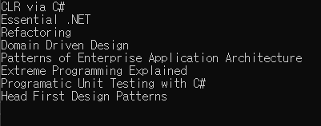
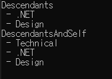
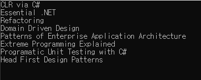
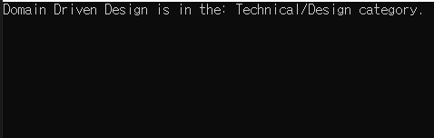
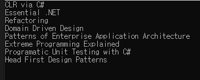

# Chapter10. LINQ to XML을 이용한 XML 질의 및 변환🦢
- **알아볼 내용:**
    - LINQ to XML이 제공하는 질의기능과 변환 기능
    - LINQ를 이용하여 XML 데이터를 어떻게 질의하는지
    - XML API 중 LINQ to XML 축 메소드
        - 축 메소드는 LINQ to XML API 내에서 XML 트리 내의 특정 개체, 속성, 노드에 선택적으로 접근시켜 줌
    - LINQ to XML 축 메소드 확인 후에는 축 메소드들을 표준 질의 연산자나 LINQ 질의 표현식과 조합하여 개발자가 원하는 LINQ의 강력한 질의능력을 어떻게 추출할 수 있는지 알아볼 것
    - XPAth를 이용하여 LINQ to XML 객체를 질의하는 것도 살펴볼 것임
    - 방향을 틀어 어떻게 LINQ to XML 을 이용하여 XML을 다른 형식으로 변환할 수 있는지
    - 모든 것이 완벽하다는 가정 하에 애플리케이션이 받는 XML 데이터는 사용자에게 보여주기 좋은, 필요로 하는 형태로 주어질지도 모름
    - LINQ to XML이 제공하는 강력한 질의기능과 함수형 생성 및 XML 리터럴을 조합하면 개발자는 쉽고 간편하게 XML 문서를 다른 형태로 변환 가능함

## 10.1 LINQ to XML 축 메소드
- LINQ 프레임워크가 제공하는 표준 질의 연산자에 의해 C#에서 가장 기초적인 수준의 구조체가 될 수 있음
- 표준 질의 연산자들은 IEnumerable<T>나 IEnumerable<T>를 구현하는 객체에 수행되었을 경우 일련의 객체 집합을 대상으로 작동 가능함
- LINQ to XML의 경우에 'I'에 해당하느 형은 보통 XElement, XAttribute, XNode일 가능성이 매우 높음

- 표준 질의 연산자를 XML 데이터에 대해 사용하기 위해 XML을 표준 질의 연산자로 질의가 가능한 일련의 객체 집합의 형태로 변환할 필요 있음
- LINQ to XML 축 메소드는 XML에 대해 이런 변환과정을 수행하여 개체, 속성, 노드 등을 검색할 수 있게 해줌
- 축 메소드에 대해 알아보기 위해 사용하게 될 샘플 XML 파일을 한 번 확인해보기
- 다음 예제의 XML은 LINQ Books 카탈로그 내에 있는 책들의 부분집합을 나타냄
- [XML의 트리형태의 구조를 잘 보여주는 예제 XML 파일]
```XML
<category name="Technical">
    <category name=".NET">
        <books>
            <book>CLR via C#</book>
            <book>Essential .NET</book>
        </books>
    </category>
    <category name="Design">
        <books>
            <book>Refactoring</book>
            <book>Domain Driven Design</book>
            <book>Patterns of Enterprise Application Architecture</book>
        </books>
    </category>
        <books>
            <book>Extreme Programming Explained</book>
            <book>Programatic Unit Testing with C#</book>
            <book>Head First Design Patterns</book>
        </books>
</category>
```
- LINQ to XML 축 메소드를 이용하면 관심을 가질만한 개체와 속성들을 추출 가능함
- 어떤 결과가 나올지 이해하고 예측하기 위해서는 XML 트리 내에서 현재 위치가 어디인지 알아야 함

- LINQ to XML 축 메소드에 대해서 알아보자
- LINQ to XML 축 메소드가 어떤 기능을 제공하는지 살펴보기 위해 먼저 축 메소드의 도움을 받아 다음과 같은 결과가 나오도록 해보자
    - .NET
    - - CLR via C#
    - - Essential .NET
- 이런 결과를 만들기 위해서는 Element, Attribute, Elements라는 세 가지 축 메소드에 대해서 알아야 함
- 이 세 가지 축 메소드에 대해서 잘 이해하고 나면 Descendants나 Ancesotrs와 같은 몇몇 다른 축 메소드에 대해서도 알아보도록 하겠음
- 어떻게 Element 축 메소드를 사요하여 목표를 쉽게 달성할 수 있는지 알아보기

### 10.1.1 Element
- 목표로 하는 결과를 얻기 위해 가장 먼저 해야 하는 일: XML에서 .NET 분류를 별도로 추출해내는 것
- Element 축 메소드는 이름을 통해 하나의 XML 개체를 추출하도록 함
- [Element 질의 축 메소드를 이용하여 일므을 바탕으로 개체를 선택하기]
```C#
XElement root = XElement.Load("categorizedBooks.xml");
XElement dotNetCategory = root.Element("category");
Console.WriteLine(dotNetCategory);
```
- 정적인 Load 메소드를 이용하여 XML을 XElement부터 먼저 불러들임
- XML을 다 불러들이면 Element 축 메소드를 가장 상위의 XElement에 대해서 분류를 매개변수로 하여 호출함
- Element 축 메소드는 XNAme을 매개변수로 받아들여 **맨 먼저 들어맞은 현재 개체**의 자식인 XElement를 반환함
- XName에 대해 정의된 오버로딩 연산자는 new XName("category") 대신 분류 이름을 문자열로 전달할 수 있게 해줌
- 해당 오버로딩된 연산자는 "category"라는 문자열을 자동적으로 완전한 XName으로 전환시켜 줌
- 위 예제코드는 다음과 같은 결과를 콘솔창에 출력해줌
```XML
<category name=".NET">
    <books>
        <book>CLR via C#</book>
        <book>Essential .NET</book>
    </books>
</category>
```
- 만약 Element 축 메소드에 전달된 이름으로 개체가 존재하지 않는다면 null이 반환될 것임
- ".NET"이라는 분류에 해당하는 XElement를 별도로 갖고 있으므로 전체 XML 조각 대신 분류의 이름을 출력해야 함
- 분류의 이름은 name 속성에 저장되어 있음

### 10.1.2 Attribute
- XElement 형의 .NET 분류 개체를 메모리상에 가지게 되었으므로 XElement에 대해 name 속성의 값에 대한 질의를 수행할 것임
- name 속성을 가져오기 위해 축 메소드인 XAttribute를 가져올 것임

- Attribute는 제시된 XName을 바탕으로 들어맞는 첫 번째 속성을 반환함
- 이 경우에는 XElement에 한 가지 속성만 정의되어 있지만 항상 그런 것은 아님
- name 속성에 관심이 있으므로 name을 매개변수로 해서 다음 코드와 같이 Attribnute 축 메소드를 호출해보쟝
- [Attribute 메소드를 이용하여 XML 개체에서 속성을 가져오기]
```C#
XElement root = XElement.Load("categorizeBooks.xml");
XElement dotNetCategory = root.Element("category");
XAttribute name = dotNetCategory.Attribute("name");
```
- Element 축 메소드처럼 Attribute는 주어진 XName을 가진 첫 번째 속성을 반환함
- 만약 주어진 XName을 가진 속성이 없다면 null이 반환됨
- XAttribute를 반환받아서 가지고 있음으로 분류의 제목을 다음과 같이 XAttribute를 문자열로 캐스팅하는 형태로 출력 가능함
- `Console.WriteLine((string)name);`
- 다음과 같은 결과를 출력함
```C#
.NET
```

- 일단 XElement를 확보하게 되면 분류의 이름을 Attribute  질의 축 메소드의 도움을 받아 출력이 가능
- 그 다음, 분류 XElement를 질의해서 그 질의에 담긴 모든 책 개체를 가져와야 함
- 불행히도... 복수의 개체를 가져와야 하므로 Element 메소드를 사용 불가능
- Elements 축 메소드를 배울 때가 되었음

### 10.1.3 Elements
- Elements 축 메소드는 Element 질의 축 메소드와 비슷한 일을 함
- **중요한 차이점:**
    - 맨 처음 들어맞는 Element를 반환하는 대신, Elements는 들어맞는 모든 개체를 반환함
    - 이런 측면에서, Elements가 XElement 객체의 IEnumerable을 반환한다는 것이 그리 놀랍지는 않음
    - Element처럼 Elements는 XName을 매개변수로 받아들임

- 이 경우에는 모든 <book> 객체를 찾고 있으므로 책을 Elements에 매개변수로 전달할 것임
- <book> 개체들이 앞에서 선택했던 분류를 나타내는 XElement의 바로 아래에 있는 개체들이 아니므로 Element query 축 메소드를 이용하여 <books> 개체를 선택해야 함
- [Elements 질의 축 메소드를 이용하여 모든 자식 책 개체들을 가져오기]
```C#
XElement root = XElement.Load("categorizedBooks.xml");
XElement dotNetCategory = root.Element("category");
XAttribute name = dotNetCategory.Attribute("name");

XElement books = dotNetCategory.Element("books");
IEnumerable<XElement> bookElements = books.Elements("book");

Console.WriteLine((string) name);
foreach(XElement bookElement in bookElements)
{
    Console.WriteLine(" - "+(string)bookElement);
}
```
- 수행 결과는 다음과 같음
```C#
.NET
 - CLR via C#
 - Essential .NET
```
- Elements 메소드는 매개변수를 받아들이지 않는 오버로딩된 버전을 갖고 있음
- 이 버전은 XElement의 모든 자식 개체를 가져오기 위해 사용 가능함
- 예제 코드에서는 어차피 <books>는 <book> 개체들만 자식 개체로 갖고 있으므로 매개변수를 갖지 않는 버전의 Elements를 호출함

- Elements가 XElement의 바로 하위 자식 개체들만 탐색한다는 것은 반드시 알아둬야 함
- 바로 아래 계층의 자식 개체들보다는 현재 개체보다 하위 계층에 있는 모든 개체들에 대하여 탐색하기 원하는 경우가 많음
- 이런 경우 LINQ to XML에서는 Descendants라는 축 메소드를 지원함

### 10.1.4 Decendants
- Decendants 축 메소드는 Elements 메소드와 동일한 방식으로 동작함
- 그러나 반환되는 개체를 현재 개체의 모든 하위 개체로 해서 반환함
- Decendants 축 메소드는 특정한 XName을 가진 모든 개체들을 가져오고 싶지만 어디쯤 있는지 잘 모를 경우에 유용함
- Decendants 축 메소드에는 두 가지 형태가 있음
    - 1. 매개변수로 xName을 받아 해당 XName을 가진 현재 개체 아래의 모든 개체를 반환
    - 2. 매개변수 없이 호출되어 XName과 관계없이 하위의 모든 개체를 반환해줌
- 이제는 앞에 있었던 XML을 재활용할 것
- 하나의 분류에 속한 모든 책들을 검색하는 대신 분류와 관계없이 모든 책들을 반환하고자 함
- 책 개체들이 XML의 여러 다른 계층에 존잭가능하므로 Elements를 사용하는 것은 불가능함
- 대신 당연히 Decendants 축 메소드를 이용하게 될 것임
- XML 내의 모든 책들을 가져오려면 다음과 같은 형태로 코드를 작성하면 됨
- [Decendants 메소드를 이용하여  XML 내의 모든 책들을 가져오기]
```C#
XElement books = XElement.Load("categorizedBooks.xml");
foreach (XElement bookElement in books.Descendants("book"))
{
    Console.WriteLine((string)bookElement);
}
```
- [결과]
- 
- Descendants 축 메소드는 자기 자신을 검색된 개체의 트리에 포함시키지 않는다는 것이 중요함
- 현재 개체를 포함시키고자 한다면 DesendatnsAndSElf 축 메소드를 사용하면 됨
- Descendants 축 메소드처럼 DescendantsAndSelf 메소드 또한 XElement객체들의 IEnumerable 컬렉션을 반환함
- 유일한 차이점: DescendantsAndSelf가 자기 자신을 반환하는 XElement 객체에 포함시킨다는 것
- [앞에서 사용해왔던 XML]
```XML
<category name="Technical">
  <category name=".NET">
    <books>
      <book>CLR via C#</book>
      <book>Essential .NET</book>
    </books>
  </category>
  <category name="Design">
    <books>
      <book>Refactoring</book>
      <book>Domain Driven Design</book>
      <book>Patterns of Enterprise Application Architecture</book>
    </books>
  </category>
  <books>
    <book>Extreme Programming Explained</book>
    <book>Programatic Unit Testing with C#</book>
    <book>Head First Design Patterns</book>
  </books>
</category>
```
- 이제 다음과 같은 코드를 바탕으로 Descendants와 DescendantsAndSelf 메소드를 비교해보자
- [Descendants와 DescendantsAndSelf 축 메소드의 비교]
```C#
XElement root = XElement.Load("categorizedBooks.xml");
IEnumerable<XElement> categories = root.Descendants("category");

Console.WriteLine("Descendants");
foreach (XElement categoryElement in categories)
{
    Console.WriteLine(" - "+(string)categoryElement.Attribute("name"));
}

categories = root.DescendantsAndSelf("category");
Console.WriteLine("DescendantsAndSelf");
foreach (XElement categoryElement in categories)
{
    Console.WriteLine(" - "+(string)categoryElement.Attribute("name"));
}
```
- [실행 결과]
- 
- 코드에서 알 수 있듯이 Descendants와 DescendantsAndSelf의 호출방법은 완전히 동일함
- 실행 결과를 살펴보면 DescendantsAndSElf는 상위 분류(Technical)을 출력에 포함시켰음을 알 수 있음

- Descendants와 DescendantsAndSelf를 이용해 간편하게 하나의 XML 트리내에서 관심있는 모든 개체들이 현재 노드 아래에 있을 경우, 하위 개체들을 손쉽게 가져올 수 있음
- XML에 대해 질의할 때, Element, Elements, Attribute, Descendants는 XML 트리내에서 관심 있는 개체와 속성들을 찾아내는 가장 핵심적인 축 메소드임을 뜻함

- Elements와 Descendants가 IEnumerable<XElement>를 반환해줌 -> 그 결과물은 표준 질의 연산자나 질의 표현식과 매우 잘 연동되어 사용 가능함
- [XML에 대해 질의하기 위해 LINQ 질의 표현식 문법을 이용하기]
```C#
XElement root = XElement.Load("categorizedBooks.xml");
var books = from book in root.Descendants("book")
            select (string)book;

foreach (string book in books)
{
    Console.WriteLine(book);
}
```
- [실행결과]
- 
- 여기서 확인 가능하듯이 Descendants 축 메소드를 이용하면 LINQ to XML을 통해 객체와 관계형 데이터에 대한 질의를 하는 것과 동일한 문법으로 XML 데이터에 대해 질의 가능함

### 10.1.5 Ancestors
- Ancestors 축 메소드는 탐색의 방향만 반대일 뿐 나머지는 모두 Descendants 메소드와 동일하게 동작함
- 동일한 메소드 시그너처를 가지고 있고 AncesotrsAndSelf, AncestorNodes와 같이 유사한 아류 메소드들을 갖고 있음
- Ancestors는 XML 트리상에서 현재 노드 위에 존재하는 개체들을 탐색함
- 지금까지는 어떻게 분류 개체내에 있는 책들의 목록을 Element와 Elements를 이용하여 가져오는지, 그리고 어떻게 XML 내의 모든 책들을 DEscendants로 가져오는지에 대해 살펴봄
- 이 절에서는 어떻게 Ancestors를 이용해 특정 책이 속한 모든 분류의 목록을 얻어낼 수 있는지 알아볼 것
- 분류는 다음과 같은 형태로 나타남
- `Domain Driven Design is in the: Technical/Design category.`

- 가장 먼저 해야할 일: 관심을 가지고 있는 책들을 선택하는 것
- XML에 Descendants 축 메소드를 이용해서 모든 책들을 가져와야 함
- 모든 책들을 가져오고나면 책의 목록에 대해 다음처럼 Where와 First같은 표준 질의 연산자를 이용하여 관심 있는 하나의 책으로 좁혀나감
```C#
XElement root = XElement.Load("categorizedBooks.xml");
XElement dddBook = root.Descendants("book")
                        .Where(book =>
                              (string)book == "Domain Driven Design"
                        ).First();
```
- Domain Driven Design이라는 책 개체를 골라냄
- 책 개체를 갖게 되면 Ancestors 축 메소드를 호출하여 책 개체가 속한 분류의 목록을 얻어올 수 있음
- 분류의 목록에 Reverse와 String.Join을 활용하여 처리해주면 원하는 규격으로 분류정보를 받아올 수 있음
```C#
XElement root = XElement.Load("categorizedBooks.xml");
XElement dddBook = root.Descendants("book")
                        .Where(book =>
                        (string)book == "Domain Driven Design"
                        ).First();

IEnumerable<XElement> ancestors = dddBook.Ancestors("category").Reverse();

string categoryPath =
        String.Join("/", ancestors.Select(e =>
        (string)e.Attribute("name")).ToArray());

Console.WriteLine((string)dddBook + " is in the: "+categoryPath+" category.");
```
- [결과]
- 

### 10.1.6 ElementsAfterSelf, NodesAfterSelf, ElementsBeforeSelf, NodesBeforeSelf
- ElementsAfterSelf, ElementsBeforeSelf, NodesAfterSelf, NodesBEforeSelf 메소드는 현재 개체의 앞뒤에 존재하는 모든 개체를 받아올 수 있는 매우 쉬운 방법을 제공
- ElementsBeforeSelf: 현재 개체보다 앞에 있는 모든 XElement 개체 반환
- ElementsAfterSelf: 현재 개체보다 뒤에 있는 모든 XElement 개체 반환
- 유사하게 개체만 받아오지 않고 모든 노드를 받아오고 싶다면 NodesBeforeSelf와 NodesAfterSelf 메소드를 사용 가능함
- **중요한 점:**
    - Ancestors나 Descendants 축 메소드랑 달리 ElementsBeforeSelf, ElementsAfterSelf, NodesBeforeSelf, NodesAfterSelf 메소드들은 현재 개체와 동일한 계층에 있는 개체들만 탐색한다는 것임
- [특정 개체와 동일한 계층에 있는 모든 개체 노드들을 ElementsBEforeSelf로 찾아내기]
```C#
XElement root = XElement.Load("categorizedBooks.xml");
XElement Book = root.Descendants("book")
                    .Where(book =>
                           (string)book == "Domain Driven Design"
                           ).First();

IEnumerable<XElement> beforeSelf = Book.ElementsBeforeSelf();
foreach (XElement element in beforeSelf)
{
    Console.WriteLine((string) element);
}
```
- [실행결과]
- 

- 출력된 결과로 알 수 있듯이 ElementsBeforeSElf는 현재 노드와 같은 계층에 있는 개체들들로 탐색의 범위가 제한됨
- Ancestor나 Descendants 축 메소드와 같이 계층간을 오가며 탐색하지 않는다는 뜻임

## 10.2 표준 질의 연산자
- 표준 질의 연산자들은 IEnumerable<T>나 IQueryable<T>를 구현하는 어떠한 시퀀스의 객체들에도 동작함
- 축 메소드들은 XElement나 XAttribute, XNode 객체의 IEnumerable 를 반환하여 표준 질의 연산자를 사용 가능하게 함
- 표준 질의 연산자를 사용할 수 있게 되면서 LINQ to XML 축 메소드들은 객체나 관계형 데이터에서 XML 데이터까지 배운 모든 것들을 활용가능하게 해줌
- 객체, 관계형 데이터, XML 등을 오가면서 전혀 새로운 언어나 문법을 배워야 하는 대신 LINQ를 이용하여 세 가지 모두를 동일한 표준 질의 연산자와 질의 표현식을 이용하여 질의 가능함

- 표준 질의 연산자를 이용하여 Amaxon에서 가장 많이 태그가 달린 20권의 책을 포함하는 XML 속을 탐색해볼 것
- 표준 질의 연산자를 이용하여 책의 목록 속을 훑어보고 가장 재미있다고 생각되는 책들로 목록 범위 축소 -> 출판사별로 그룹화할 것임
- 어떻게 Amaxon.com에서 태그가 많이 달리 냋ㄱ들의 목록을 담은 XML을 받아올 수 있는지 알아보자

- Amazon은 Amazon.com이 보유하고 있는 데이터들에 웹 서비스 AI를 통해 접근 가능하게 해주는 몇 가지 웹 서비스를 제공하고 있음
- Amazon의 웹 섯비스에 접근하기 위해 Amazon의 웹 서비스 프로그램에 가입해야 함
- 가입 -> 사용자의 계정에서 Amazon 웹 서비스에 접근 가능한 접근 키들이 주어짐
- amazon 관련 내용은 책을 참고하기...
- select를 이용하여 각각의 책의 제목을 XML에서 읽어오자

### 10.2.1 Select로 사영하기
- 가장 자주 사용되는 표준 질의 연산자
- 시퀀스에 대해 사영(projection) 작업을 수행시킴
- 이 경우, 시퀀스는 IEnumerable<XElement>의 형식을 가지고 있음
- 어떻게 이전 절에서 논의했던 Descendants 질의 축 메소드와 함께 Select 절을 이용해서 XML에서 모든 책들의 제목들을 가져올 수 있는지 알아보자
- [표준 질의 연산자 Select를 이용하여 XML 문서에 대해 사영을 적용하기]
```C#
XElement tags = XElement.Load(url);
var titles = tags.Descendants(ns+"Title")
                 .Select(titleElement => (string)titleElement);

foreach(String title in titles)
{
    Console.WriteLIne(title);
}                 
```
- XML에 포함된 모든 <Title> 개체를 추출하기 위해 Descendants 축 메소드를 이용함
- Amazon이 반환한 XML은 기본 네임스페이스를 가지고 있음 -> 로컬 XNamespace 변수를 선언해서 Descendants 호출 시 사용
- 일단 모든 개체를 가져오면 Select 연산자를 호출, <Title> 개체에서 제목을 추출하는 선택자(selector)를 전달함
- 결과는 원본 XML에 포함된 모든 책들의 제목을 담고 있는 시퀀스
- Select 연산자는 다음과 같이 표준 질의 표현식 문법으로 나타낼 수 있음
- [LINQ 질의 표현식 문법을 이용하여 Select 표준 질의 연산자를 호출하기]
```C#
XElement tags = XElement.Load(url);
var titles = from title in tags.Descendants(ns+"Title")
             select (string)title;
```
- 결국 표준 질의 연산자를 이용하여 직접적인 메소드 호출을 하는 문법을 사용하든지 질의 표현식 문법을 사용하든지 동일한 코드기 실행됨
- 질의 표현식이 가진 표현력&간결함 -> 질의 표현식을 더 선호함

### 10.2.2 Where로 필터링하기
- Where 연산자는 분류상 제한 연산자에 속함
- 책의 목록을 관심 있는 부분집합으로 제한해주는 역할을 하기 때문임
- 책들을 필터링하기 위해 사용 가능한 속성들은 그리 많지 않음
- 그래서 제목에 "Windows Presentation Foundation"이 있는 책들을 걸러내는 필터링만 가해줄 것임
- [Amazon.com에서 XML을 불러오고 책의 목록을 where절을 통해 필터링하기]
```C#
XElement tags = XElement.Load(url);

var wpfBooks = 
    from book in tags.Descendants(ns+"Item")
    let bookAttrbutes = book.Element(ns + "ItemAttributes")
    let title = ((string)bookAttributes.Element(ns+"Title"))
    where title.Contains("Windows PResentation Foundation")
    select title;

foreach(string title in wpfBooks)
{
    Console.WriteLine(title);
}
```
- let 연산자: 값을 할당할 때 사용함
- [실행결과]
```C#
Windwos Presentation Foundation Unleashed (WPF) (Unleashed)
Programming Windows Presentation Foundation (Programming)
```
- 책의 목록을 필터링하기 위해 XML의 모든 <Item> 개체들을 Descendants 축 메소드를 이용하여 선택함
- 일단 모든 개체가 <Item>개체가 선택되고 난 후 let 절을 이용하여 <ItemAttributes> 개체를 bookAttribute라는 질의 변수에 할당
- 최종적으로 where 절을 구성하여 제목에 "Windows Presentation Foundation"이 들어가는 책으로만 목록을 제한함

- where절을 표현하기 위해 <Title> 개체를 string로 캐스팅해야 함
- 다행히 LINQ to XML은 XElement와 XAttribute 객체를 위해 명시적인 오버로딩된 연산자를 제공하고 있음
- 일단 <Title> 개체가 string로 캐스팅되고 난 후애  where 절의 정의를 Contains 메소드를 "Windows Presenatation Fourndation:을 매개변수로 하여 수행하면 됨

### 10.2.3 정렬과 그룹화
- LINQ는 정렬을 위해 두 가지의 표준 질의 연산자를 제공함
- OrderBy 표준 질의 연산자는 열거된 개체들을 오름차순으로 정렬함
- 만약 오름차순이 아니라 내림차순으로 정렬하고 싶다면 OrderByDescending 표준 질의 연산자를 이용하면 됨
- OrderBy와 ORderByDescending 모두 동일한 질의 표현식 구조를 갖고 있음
- [orderby 표현식으로 질의의 결과들을 정렬하기]
```C#
XElement tags = XElement.Load(url);
var groups = 
  from book in tags.Descendants(ns+"Item")
  let bookAttributes = book.Element(ns+"ItemAttributes")
  let title = (string)bookAttributes.Element(ns+"Title")
  orderby title
  select title;
```
- 책을 오름차순이 아닌 내림차순으로 정렬하는 것은 단순히 orderby title 클래스를 orderby title descending 클래스로 변환하는 정도의 일
- orderby 연산자는 객체나 관계형 데이터에서도동일한 형태로 동작함
- 유일한 차이점: 정렬에 사용되는 키값이 Element, XAttribute, XNode와 같은 LINQ to XML 객체가 된다는 것
- 여러 개의 키값을 설정하는 것이 가능 -> 하나의 표현식내에서 같은 키값을 가진 개체를 또다시 다른 키값으로 정렬 가능하게 됨

- GroupBy 연산자를 알아보자
- GroupBy 표준 질의 연산자는 일련의 데이터를 특정 조건에 따라 그룹화할 수 있게 해줌
- [group 표현식으로 질으의 결과들을 그룹화하기]
```C#
XElement tags = XElement.Load(url);
var groups =
    from book in tags.Descendants(ns+"Item")
    let bookAttributes = book.Element(ns+"ItemAttributes")
    let title = (string)bookAttributes.Element(ns+"Title")
    let publisher = (string)bookAttributes.Element(ns+"Manufacturer")
    orderby publisher, title
    group title by publisher;
```
- 질의 내에서 Descendants 축 메소드를 이용하여 책들을 추출하는 것부터 함
- Element 축 메소드를 통해 책 제목과 출판사에 관한 정보를 받아옴
- 책 제목과 출판사에 대한 정보를 바탕으로 결과를, 먼저 출판사, 그리고 책 제목순으로 정렬, 마지막에 출판사별로 그룹화함
- group by 질의 표현식은 IGrouping<K, T>와 IEnumerable<T> 인터페이스를 구현하는 객체를 반환함
- K는 group by를 적용하려는 값의 형이고 T는 그룹 안에 집어넣는 객체의 형임
```C#
group title by publisher
//      T        K(group의 키)
```
- group by 표현식 내에서 T와 K에 해당하는 형은 모두 문자열임
- group의 key는 publisher, group에 담겨있는 아이는 title
- 받아온 결과가 출판사별로 그룹화되었으므로 반환된 결과들에 대해 반복문을 수행하여 콘솔에 표시해보자
```C#
foreach(var group in groups)
{
    Console.WriteLine(Group.Count() + "book(s) published by "+group.Key);
    foreach(Var title in group){
        Console.WRiteLine(" - "+title);
    }
}
```
- 모든 표준 질의 연산자들이 동등한 질의 표현식 절을 갖고 있는 것은 아님
- LINQ to Objects나 LINQ to SQL처럼 LINQ to XML은 고전적인 표준 질의 연산자 메소드들을 이요하여 그런 연산자들을 호출하도록 하고 있음

## 10.3 XPath를 이용하여 LINQ to XML 객체에 대해 질의하기
- XPath는 축 메소드나 표준 질의 연산자들처럼 XML 문서에서 정보를 찾는 데 사용되는 언어
- 그러나 XML 트리를 탐색하여 원하는 개체와 속성을 찾아내는 API를 제공하는 대신, XPath는 텍스트 기반의 질의 언어를 사용하여 받아오고 싶은 정보를 정의하여 수행하는 방법을 제공함
- XML 데이터에 대해 질의할 때 사용하는 두 가지 주요 도구는 표준 질의 연산자와 LINQ to XML 축 메소드
- 그러나 XML을 다룰 때, 보편화되어 있는 XPath 질의를 사용할 수도 있음
- 이를 위해 System.Xml.XPath 네임스페이스 속에 XPath를 LINQ to XML 객체들에 대해 사용할 수 있게 해주는 몇 가지 연결고리가 추가됨
- LINQ to XML에 대해 XPath를 이용하기 위해서는 System.Xml.XPAth 네임스페이스에 다음과 같이 참조를 추가해줘야 함
- `using System.Xml.XPath`
- 이런 참조를 추가하면 클래스들에 몇 개의 XNode에서 가져오 ㄴ확장 메소드를 추가해줌
- XPathNavigator를 생성가능하게 되는 것 외에도 확장 메소드들은 XPath표현식이 XPathEvaluate메소드를 통해 XNode에 대해 평가받을 수 있게 해줌
- 마지막으로 XPathSelectElement와 XPathSElectElements 확장 메소드는 LINQ to XML 객체를 XPath 표현식을 통해 검색 가능하게 함
- XPathSelectElement는 XPath 표현식을 만족하는 첫 개체를 반환하고 XPathSelectElements는 만족하는 모든 개체들을 반환함
```XML
<category name="Technical">
  <category name=".NET">
    <books>
      <book>CLR via C#</book>
      <book>Essential .NET</book>
    </books>
  </category>
  <category name="Design">
    <books>
      <book>Refactoring</book>
      <book>Domain Driven Design</book>
      <book>Patterns of Enterprise Application Architecture</book>
    </books>
  </category>
  <books>
    <book>Extreme Programming Explained</book>
    <book>Programatic Unit Testing with C#</book>
    <book>Head First Design Patterns</book>
  </books>
</category>
``` 
- XPath를 사용해서 XML에 대해 질의하는 과정에서 어떻게 이 확장 메소드들을 이용할 수 있는지 알아보자
- Descendants 질의 축 메소드는 전체 XML 트리 속을 탐색하므로 이런 식의 질의를 하기에 알맞음
- 동등한 질의를 XPath로 하여 트리 내의 모든 book 개체를 가져오려면 //book과 같이 질의 가능
- PathSelectElements 확장 메소드가 IEnumerable<XElement> 를 반환하므로 다음의 질의 표현식 문법을 이용하여 질의 작성 가능
- [XPath를 이용하여 XElement 객체에 대해 질의하기]
```C#
XElement root = XElement.Load("categorizedBooks.xml");
var books = from book in root.XPathSelectElements("//book")
            select book;

foreach (XElement book in books)
{
    Console.WriteLine((string)book);
}
```
- [실행결과]
- 

## 10.4 XML 변환하기
- LINQ to XML은 LINQ의 표준 질의 연산자와 축 메소드, 함수형 생성의 장점들을 바탕으로 XML을 변환하는 매우 강력하고 직관적인 방법을 제공함

### 10.4.1 LINQ to XML 변환
- 다음 코드의 XML을 브라우저에서 볼 수 있는 XHTML 문서로 변환시켜봄
```xml
<?xml version="1.0" encoding="utf-8" ?>
<books>
    <book>
        <title>LINQ in Action</title>
        <author>Fabrice Marguerie</author>
        <author>Steve Eichert</author>
        <author>Jim Wooley</author>
        <publisher>Manning</publisher>
    </book>
    <book>
        <title>AJAX in Action</title>
        <author>Dave Crane</author>
        <publisher>Manning</publisher>
    </book>
    <book>
        <title>Patterns of Enterprise Application Architecture</title>
        <author>Martin Fowler</author>
        <publisher>Apress</publisher>
    </book>
</books>
```
- 변환을 마쳤을 때는 다음과같은 XHTML을 얻을 수 있음
```xhtml
<html>
    <body>
        <h1>LINQ Books Library</h1>
        <div>
            <b>LINQ in Action</b>
            By: Fabrice Marguerie, Steve Eichert, Jim Wooley
            Published By: Manning
        </div>
        <div> <b>AJAX in Action</b>
            By: Dave Crane
            Published By: Manning
        </div>
        <div>
            <b>Patterns of Enterprise Application Architecture</b>
            By: Martin Fowler
            Published By: Apress
        </div>
    </body>
</html>
```
- 이런 XHTML로 변환하기 위해서는 LINQ to XML이 제공하는 축 메소드와 함수형 생성기능을 최대한 활용해야 함
- 결과 XHTML을 복사하고 XML을 LINQ로 붙여넣기라는 Visual Studio의 추가기능을 사용하여 XML을 작성하기 위한 함수형 생성 코드를 작성(여기서는 안 됨...)
- [XML 내의 각각의 책이 담고 있는 제목, 출판사, 저자 정보를 가져오기]
```C#
XElement booksXml = XElement.Load("book.xhtml");

var books = from book in booksXml.Descendants("book")
            select new {
                Title = (string)book.Element("title"),
                Publisher = (string)book.Element("publisher"),
                Authors = String.Join(", ",
                                 book.Descendants("author")
                                 .Select(a => (string)a).ToArray())
};
```
- 함수형 생성문과 질의문이 준비되었으므로 잘 조합하여 하나의 LINQ to XML 변환으로 만들어보자
- [LINQ to XML 변환을 이용하여 XML을 XHTML로 변환하기]
```C#
XElement html =
                new XElement("html",
                new XElement("body",
                    new XElement("h1", "LINQ Books Library"),
                    from book in booksXml.Descendants("book")
                    select new XElement("div",
                        new XElement("b", (string)book.Element("title")),
                        "By: " + String.Join(", ", book.Descendants("author")
                                                     .Select(b => (string)b).ToArray()) +
                        "Published By: " + (string)book.Element("publisher")
                    )
                 )
                 );
html.Save("booksResult.xhtml");
```
- [실행결과]
- 
- LINQ to XML이 강력한 변환기능을 제공하는 과정에서 LINQ to XML을 개발한 팀은 기존의 애플리케이션이 변환을 위해 XSLT에 상당히 많은 투자를 하고 있다는 사실을 인지
- LINQ to XML 객체를 XSLT를 이용하여 변환하는 기능도 함께 제공함

### 10.4.2 LINQ to XML 객체를 XSLT를 이용하여 변환하기